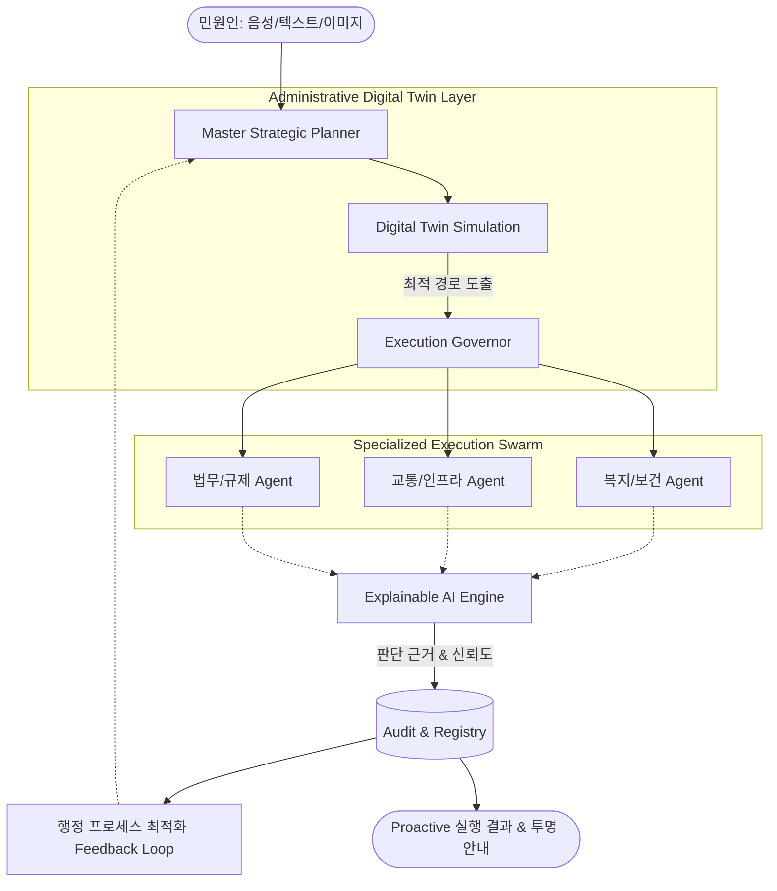

### 1. 개요 및 추진 배경 (Overview & Background)

#### 1.1 추진 배경: 행정의 한계와 도전
- **복합 민원 급증**: 사회 구조 고도화에 따라 부처 간 경계를 넘나드는 다차원적 복합 민원 발생량 매년 15% 이상 증가.
- **인구 구조 변화**: 고령 인구 및 디지털 취약계층 비중 확대로 인한 정보 격차 및 행정 접근성 저하.
- **칸막이 행정의 한계**: 부처 간 데이터 단절 및 소관 불분명 민원의 경우 평균 3.5일 이상의 처리 지연 발생.

#### 1.2 전략적 비전
**"국민은 더 이상 ‘어디에 민원을 넣어야 할지’ 고민하지 않아도 된다. AI는 문제를 분해하고, 실행하고, 결과까지 책임지는 행정 파트너가 된다."**

**"기존 행정은 '민원을 기다리는 시스템'이었다면, 본 설계는 '문제를 예측하고 먼저 실행하는 시스템'으로의 패러다임을 전환한다."**

본 설계안은 기존의 단순 '안내 및 접수' 중심 민원 행정을 넘어, AI 에이전트 오케스트레이션을 통한 **'연속적·선제적 실행형(Predictive & Proactive) 행정 서비스'**로의 진화를 목표로 함. 행정 프로세스의 디지털 트윈을 기반으로 민원의 복합적 맥락을 실시간 분석하고, 범정부 차원의 최적화된 실행 경로를 자율적으로 설계 및 제어하는 차세대 행정 인프라를 제안함.

---

### 2. 차세대 AI 행정 아키텍처 (Advanced Architecture)

#### 2.1 멀티에이전트 기반 가상 행정 오케스트레이션
- **Master Strategic Planner**: 민원인의 초저개인화된 요구사항을 해석하고, 행정 목적 달성을 위한 최적의 'Action Plan'을 생성함.
- **Process Digital Twin Agent**: 현실의 행정 절차를 가상 세계에 복제하여 실행 전 시뮬레이션을 수행하고, 병목 구간 및 법령 위반 가능성을 사전 예측(Predictive)함.
- **Domain Specialist Swarm**: 각 부처별 전문 데이터셋과 RAG로 무장한 에이전트 군집이 복합 민원의 세부 태스크를 병렬 처리하며, 부처 간 칸막이 없는 협업(Seamless Collaboration)을 수행함.

#### 2.2 하이퍼 오케스트레이션 흐름도 (Hyper-Orchestration Flow)

---

### 3. 기술 구현 스택 및 실행 아키텍처 (Technical Stack & Implementation Architecture)

본 시스템은 고신뢰 행정 업무의 특성을 고려하여, 복원력과 투명성이 확보된 계층형 기술 스택을 기반으로 설계됨.

#### 3.1 Orchestration & Multi-Agent Framework
- **Framework**: **Graph-based Orchestration Framework (예: LangGraph)** 기반의 유향 순환 그래프(Directed Acyclic Graph) 구조 채택. 상태 전이(State Transition)의 명확한 통제와 에이전트 간의 루프(Feedback Loop) 제어를 최적화함.
- **Control Logic**: **Execution Governor**가 각 노드의 입출력을 검증하며, 사전에 정의된 **Administrative Schema (예: JSON 기반 행정 태스크 검증 스키마)**를 벗어나는 추론을 원천 차단함.

#### 3.2 LLM & Knowledge Layer
- **Hybrid LLM Strategy**: 
    - **Computing**: 보안 및 데이터 주권 확보를 위한 **On-premise 경량형 sLLM (국산 LLM 포함) Fine-tuned 기반** 운영.
    - **Reasoning**: 복잡도가 극도로 높은 분석 태스크에 한해 데이터 비식별화 후 **Private Cloud LLM**을 제한적으로 연동.
- **Advanced RAG Configuration**:
    - **Vector DB**: 행정 법령 및 매뉴얼의 계층 구조를 보존하는 **Milvus / Pinecone** 환경 구축.
    - **Semantic Link**: 정부 통합 데이터 플랫폼(G-Cloud) API와 실시간 연계되어 최신 행정 지식을 실시간 인덱싱함.

#### 3.3 Digital Twin & Predictive Engine Implementation
- **Process Modeling**: **BPMN 2.0 기반의 가상 행정 프로세스 모델링**을 수행하며, 기존 **전자정부 프레임워크(eGovFrame)**와의 기능적 연계 가능성을 확보함. 각 노드는 **State Machine**으로 가시화되어 실시간 상태 동기화됨.
- **Prediction Architecture**: 
    - **Model**: 과거 민원 처리 데이터를 학습한 **시계열 예측 모델 및 그래프 기반 병목 탐지 모델**을 활용하여 부서 간 병목 구간을 탐지함.
    - **Simulation**: 민원 투입 시 디지털 트윈 상에서 가상 실행을 거쳐 예상 소요 시간 및 리스크 점수(Risk Score)를 산출함.

#### 3.4 Governance & Security Stack
- **Audit & Logging**: AI의 핵심 **판단 근거 요약 로그 (Summary of Reasoning Path)**를 **Elasticsearch / Fluentd** 기반의 통합 로그 스택에 아카이빙하며, 위변조 방지를 위한 불변 로그 레코드(Immutable Log)를 생성함.
- **Zero Trust Security**: 모든 에이전트 간 통신에 mTLS를 적용하고, **RBAC (Role-Based Access Control)**를 통해 행정 데이터 접근 권한을 최소 단위로 제어함.

---

### 4. [국민 체감형 시나리오] 복합 AI 민원 처리 사례

#### Case 1: 사회 안전망 사각지대 및 법률 구제
**"1인 가구 고령 사용자가 전세보증금 반환 문제와 생활고를 동시에 호소하는 경우"**
1.  **Contextual Intake**: 사용자가 음성으로 "전세금을 못 받아 이사가 힘든데, 생활비도 떨어져서 막막해요"라고 입력.
2.  **Multi-Dimensional Analysis**: 
    - **법률 리스크 에이전트**: 임대차 계약서 자동 판독 후 보증금 반환 소송 필요성 및 법률 구조 공단 연계 리스크 점수 산출.
    - **복지 Eligibility 에이전트**: 사용자의 소득·재산 DB 조회 후 '긴급복지지원법'에 따른 수혜 가능성 자동 계산.
3.  **Proactive Execution**: AI가 전입신고 및 주거 이전 신고 초안을 생성하고, 관할 주민센터 담당자에게 예약 선제 생성 및 수혜 가능 복지 자동 안내.

#### Case 2: 행정 칸막이 해소를 통한 창업 가속화
**"청년 창업가가 요식업 창업을 준비하며 인허가, 세무, 보조금을 동시에 문의하는 경우"**
1.  **Silo Breaking**: 관할 구청(위생과), 세무서(사업자 등록), 중기부(청년 창업 지원)로 분절된 업무를 AI가 단일 접점으로 통합 분석.
2.  **Parallel Execution**:
    - **인허가 에이전트**: 건축물 대장 및 업종 제한 사항을 분석하여 영업신고 가능 여부 즉시 판독.
    - **금융/세무 에이전트**: 업종별 세액 감면 혜택과 지자체별 청년 창업 대출 금리 비교 데이터 제공.
3.  **Seamless Experience**: 사용자는 "사업자 등록과 위생 교육 신청이 완료되었습니다. 창업 보조금 신청 서류 3종을 메일로 발송했습니다"라는 통합 결과 수령.

---

### 5. 고도화된 대응 및 제어 체계 (Control & Accountability)

#### 3.1 맥락 기반 복합 민원 분해 및 지능형 라우팅
- **Contextual Decomposition**: 단순 키워드 분류가 아닌, 민원 이면의 사회적 요구사항과 법적 중복성을 해석하여 최적화된 원스톱 태스크로 재구성함.
- **Dynamic Action Routing**: 실시간 행정 자원(공무원 가용성, 처리 소요 시간 예측)과 연동하여 AI와 인간의 최적 협업 경로를 동적으로 배정함.

#### 3.2 Explainable AI (XAI) 및 책임 행정 구조
- **Traceable Reasoning**: AI의 모든 판단 과정(Chain-of-Thought)을 기록하고, 이를 공무원 및 민원인에게 이해 가능한 자연어로 설명하는 감사 추적(Audit Trail) 시스템 구축.
- **Human-in-the-Loop Governance**: AI가 고위험 판단(재량권 행사 등)을 내릴 경우, 디지털 트윈 결과값과 함께 담당 공무원에게 자동 에스컬레이션하여 최종 책임성을 확보함.

---

### 6. 지속 가능한 가치 정책 피드백 루프 (Policy Feedback Loop)
민원 처리 과정에서 축적된 비정형 데이터와 처리 결과 데이터를 학습하여 행정 프로세스 자체의 모순이나 비효율을 발견함. 이를 정책 입안자에게 리포팅하여 제도 개선(Deregulation 등)으로 연결되는 **'데이터 기반 정책 혁신 선순환 구조'**를 구현함.

---

### 7. 단계적 도입 및 발전 전략 (Strategy)
1. **Phase 1 (기점 확보)**: **복지·주거·교통** 등 국민 체감도가 높은 3개 분야를 시범 사업(Pilot) 영역으로 지정, 도메인 특화 에이전트 도입.
2. **Phase 2 (연계 확장)**: 부처 간 멀티에이전트 오케스트레이션 확대 및 범정부 데이터 통합 연계 가속화.
3. **Phase 3 (완전 전환)**: 전 영역 데이터 기반 Proactive 서비스 및 자율 정책 개선 루프 가동.

---

### 8. 기대 효과 (Strategic Impact)
- **Predictive 행정 실현**: 사고 및 민원 발생 전 징후를 예측하여 선제적으로 조치하는 예방 중심 행정으로의 진화.
- **국가 디지털 경쟁력 강화**: AI 오케스트레이션을 통한 행정 비용 절감 및 대국민 서비스 만족도의 비약적 상승(Hyper-Efficiency).
- **투명성 및 신뢰 확보**: XAI 기술을 활용한 근거 중심 행정으로 AI 도입에 따른 사회적 수용성 극대화.
