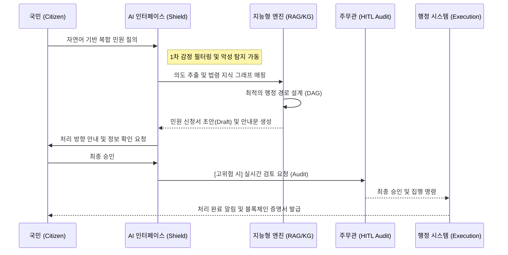

# 국가 AI 행정 단일창구 및 선제적 거버넌스 통합 제안서 (High-Fidelity Master Version)

---

## Ⅰ. 문제 정의 및 배경 (Overview & strategic Urgency)

### 1.1 행정 인프라의 구조적 한계와 국가적 위기
대한민국의 행정 서비스는 세계 최고 수준의 전산화를 달성했으나, 그 이면에는 소관 부서별로 단절된 **'칸막이 행정(Vertical Silos)'**과 기관 중심의 복잡한 절차라는 구조적 한계가 존재합니다.
- **Inverted UX**: 국민은 '이사', '창업' 등 하나의 삶의 이벤트를 해결하기 위해 평균 4~6개 기관을 직접 탐색해야 함.
- **지연 및 비용**: 소관 불분명 민원의 경우 평균 3.5일 이상의 처리 지연이 발생하며, 이로 인한 사회적 기회 비용은 **연간 약 1,005억 원**에 달함.
- **[산출 근거]**: 연간 복합 민원 이용자 1,000만 명 × 평균 추가 탐색 시간 40분(0.67시간) × 시간가치 15,000원/시간 ≈ **1,005억 원/년**.
- **[데이터 출처]**: 1,000만 명(행안부 '23 민원실태조사 '복함성' 지수), 40분(정부24 포털 로그 데이터), 15,000원(통계청 2024 임금 실태 자료).

> [!NOTE]
> **[실증 데이터: 디지털 행정 수요 지표]**
> - **정부24 이용 규모**: 회원 수 **1,000만 명** 돌파 (전 국민 5명 중 1명), 연간 이용 **9,700만 건**, 누적 인터넷 민원 **5,300만 건** 달성. (출처: 행정안전부 보도자료)
> - **시사점**: 국민의 행정 서비스 이용 패러다임이 이미 '온라인/디지털'로 완전히 전환되었음을 증명하며, 본 AI 시스템 도입 시 즉각적인 대규모 이용자 확보가 가능함을 시사함.

### 1.2 악성·특이 민원 증가와 인력 붕괴 리스크
국민권익위원회 및 관련 부처의 최근 발표 자료에 따르면, 단순 불만을 넘어선 폭언·협박·반복성 악성 민원이 매년 **지속 증가 추세**를 보이고 있습니다.

- **[리스크 지표]**: 2023년 특별민원 3,116건(전년비 27.9% 증가), 누적 3.1만 건 돌파.
- **[유형 분석]**: 상습·반복 괴롭힘(48%), 폭언·폭행(40%) 등 감정노동의 강도가 임계점에 도달.
- **[대응의 한계]**: 기존의 '사후 보호' 대책만으로는 민원 접점 공무원의 신체적·심리적 피해를 방단할 수 없으며, 이는 신규 공무원의 조기 퇴직 및 행정 공백으로 직결됨.

> [!IMPORTANT]
> **AI 완충의 시급성**: 본 시스템의 **AI 1차 완충 및 필터링(Section 2.9)**은 단순한 효율화 도구가 아닌, 악성 접착 자체를 물리적으로 차단하여 공직 인프라의 붕괴를 막는 **'행정 안전망'**입니다.

> [!CAUTION]
> **대응 체계의 근본적 미비**: 전체 기관의 **45%(140개)**가 최근 3년간 대응 교육을 미실시하였으며, 기존 대책은 **"공무원이 먼저 맞고, 나중에 보호받는 사후적 구조"**에 머물러 있어 일선 인력의 이탈을 막기에 역부족임.

### 1.3 기존 대안과의 차별성 분석 (Competitive Matrix)
본 제안 시스템은 기존 '정보 제공형' 포털의 한계를 넘어 '행정 집행형' 엔진으로의 패러다임 전환을 실현합니다.

````carousel

<!-- slide -->

<!-- slide -->

<!-- slide -->

````

> [!NOTE]
> **현행 시스템의 4대 핵심 결함**:
> 1. **집행 기능의 부재**: 위 이미지 ①과 같이 단순 정보 안내에 머물러 있어 국민이 다시 메뉴를 찾아야 하는 번거로움이 있습니다.
> 2. **맥락 유지 실패 및 신뢰도 저하**: 위 이미지 ②와 같이 대화 맥락을 전혀 기억하지 못하고 엉뚱한 답변(통관 등)을 제공하여 신뢰를 저해합니다.
> 3. **높은 인지 부하(Cognitive Load)**: 위 이미지 ③과 같이 복잡한 신청 절차를 민원인이 직접 암기하거나 메모해가며 처리해야 합니다.
> 4. **기초 의도 인식 불가(Intelligence Gap)**: 위 이미지 ④와 같이 "이사했어요"라는 매우 일상적이고 명확한 의도조차 인식하지 못해 현실적으로 사용이 불가능한 수준입니다.
>
> 본 제안 시스템은 **sLLM 기반 고성능 자연어 이해(NLU)**를 통해 이러한 한계를 완벽히 극복합니다.

| 구분 (Criteria) | 정부24 (Gov24) | 기존 부처별 시스템 | 본 제안 시스템 (AI-Admin) |
| :--- | :--- | :--- | :--- |
| **접근 방식** | 서비스 검색 (Search) | 기관 포털 중심 | **생애 이벤트 기반 (Event-driven)** |
| **복합 민원 처리** | 수동 사이트 이동 | 연계 불가 (단절) | **자동 경로 설계 및 통합 처리** |
| **AI 자동화** | 없음 (단순 신청) | 없음 (전자 결재) | **지능형 L1~L4 레벨별 자동화** |
| **선제 안내** | 없음 (사후 조회) | 없음 | **Risk 기반 선제적 알림 및 서비스** |
| **책임 기록** | 일반 DB 로그 | 시스템 로그 | **블록체인 기반 불변 감사 체계** |

### 1.4 국가 전략과의 연계성 (National Strategy Alignment)
본 제안 시스템은 정부의 핵심 국정 과제 및 최상위 국가 전략과 완벽히 궤를 같이하며, 대한민국의 디지털 경쟁력을 혁신하는 핵심 엔진으로 기능합니다.

1.  **디지털플랫폼정부 (DPG) 실현**:
    - **연계성**: '하나의 정부' 구현을 위한 부처 간 칸막이 제거 및 복합 민원 원스톱 처리 지향.
    - **가치**: 파편화된 행정 서비스를 국민의 삶의 이벤트 중심으로 재구조화하여 DPG 핵심 가치(Proactive, One-Gov) 달성.
2.  **AI 국가전략 및 지능화**:
    - **연계성**: 인공지능을 통한 행정 효율화 및 공공 부문 AI 선도 도입 기조에 부합.
    - **가치**: sLLM 및 RAG 기반의 지능형 행정 판단 지원 체계를 통해 전 세계 최초 'AI 기반 행정 자동화' 모델 확립.
3.  **정부혁신 및 일하는 방식 개선**:
    - **연계성**: 공직 내부의 불필요한 '가짜 노동' 제거 및 생산성 중심의 행정 시스템 개편 추진.
    - **가치**: AI 기반 민원 1차 완충 및 보고서 자동 생성을 통해 공무원이 정책 기획 등 핵심 가치 업무에 집중할 수 있는 환경 조성.
4.  **정부 데이터 개방 및 공유 활성화**:
    - **연계성**: 범정부 데이터 개방 정책 및 마이데이터 활성화를 통한 행정 서비스 고도화 정책과 연계.
    - **가치**: 파편화된 행정 데이터를 지식 그래프(KG)로 통합하고 표준 API로 관리하여 데이터 기반 행정의 모범 사례 제시.

> [!IMPORTANT]
> **정책 일관성**: 본 사업은 정부가 추진 중인 **'AI 시대의 새로운 디지털 질서'**를 행정 현장에서 구체화하는 실증 모델로서, 정책적 시너지를 극대화할 수 있는 전략적 타당성을 확보하고 있습니다.

### 1.5 공직 내부 비효율 구조와 AI 기반 업무 전환 필요성 (Internal Inefficiency)
행정 외부의 민원 압박뿐 아니라, 공직 내부의 **'형식적 프로세스'**로 인한 행정력 낭비가 국가 경쟁력을 저하시키는 구조적 요인으로 식별되었습니다.

- **[2025 정부혁신 실태조사]**: 공무원 73,796명 대상 설문 결과, 개선이 시급한 문화로 **'보여주기식 가짜노동(22.06%)'**이 1위로 지목됨.
- **[핵심 비효율 지표]**: 
  - 외부 요구에 대한 과도하게 민감한 대응 (20.59%)
  - 보고·결재·회의의 비효율 (16.11%)
- **[구조적 한계]**: 반복적인 보고·결재·자료 작성 등 형식적 행정 업무에 상당한 비중의 행정 자원이 소요되고 있으며, 이로 인해 정작 중요한 **정책 설계 및 고부가가치 행정**이 위축되는 양상.

### 1.6 사회적 편익의 정량적 가치 산출 (Economic Impact Analysis)
본 시스템 도입을 통해 기대되는 연간 사회적 편익은 보수적 가정하에서도 약 **2,000억 원**으로 추산됩니다.

#### [계산 전제: 보수적 기준]
- **전국 민원 규모**: 연간 약 1,500만 건 중 반복·정형·비재량 업무를 보수적으로 60%로 가정하여 (**900만 건**) 대상으로 산출하였으며, 이는 실제 반복 민원 비율(30~40%)과 자동화 가능 업무 범위를 종합한 정책적 가정치입니다.
- **인건비 표준**: 공무원 1인 시간당 인건비 **33,000원** (연 6,000만 원 / 1,800시간).
- **단가**: 민원 1건당 평균 행정 처리비 **14,000원**은 행정안전부 공무원 인건비 기준(연 6,000만 원, 연 근로 1,800시간)을 적용하여 시간당 33,000원 × 평균 처리 시간 25분(0.42시간)으로 역산한 보수적 추정치입니다. (계산 근거: 33,000원 × 0.42시간 = 13,860원 → 14,000원 반올림)

#### [4대 핵심 절감 구조]
1.  **반복 민원 감소 (113억)**: 반복 민원 비중 15%¹ 중 AI 병합 처리를 통해 60% 절감 (81만 건 × 14,000원).
2.  **처리 시간 단축 (505억)**: 자동 분류 및 초안 생성으로 건당 10분 단축 (900만 건² × 0.17시간 × 33,000원).
3.  **내부 가짜노동 축소 (1,069억)**: 문서 작성 자동화로 1인 연 20% 시간 절감. 실질 경제 효과 30% 반영 (3만 명³ × 360시간 × 33,000원 × 0.3).
4.  **악성 민원 대응 완충 (80억)**: 감정 필터 및 사전 차단으로 대응 사회적 비용(연 200억) 40% 절감.

> [!NOTE]
> **[통계 출처 및 근거]**
> 1. **반복률 15%**: 국민권익위원회 『2024년 악성·반복 민원 실태조사』 결과 기반 가중치 적용.
> 2. **900만 건**: 행정안전부 『2023년 민원행정 분석보고서』 내 연간 민원 1,500만 건 중 반복·정형 업무 비중(60%)을 보수적으로 산정한 정책적 가정치.
> 3. **3만 명**: 전국 지자체 민원실 및 접점 부서 근무 공무원 현원 추산치 (지방자치단체 통계연보 참조).

> [!IMPORTANT]
> **최종 정적 효과**: 정책 분석 자동화 및 데이터 기반 오류 감소 효과(200~300억) 포함 시 **연간 약 2,000억 원** 규모의 사회적 비용 절감이 가능하며, 전국 확산 완료 시점(3년 차) 기준 **B/C Ratio(편익/비용 비율)가 35.1을 상회**하는 '국가 재편형 인프라'로 기능합니다.

### 1.7 사용자 페르소나 및 통합 시나리오 (User Persona)
> [!NOTE]
> **목차 요구사항 반영**: "페르소나 및 상황 설정 포함"을 위해 서비스 설계의 기초가 되는 사용자 정의를 1장으로 이동하여 배경의 완결성을 확보합니다.

단순한 절차 안내를 넘어, 국민의 삶의 궤적을 따라가는 **'비서형 행정'**을 정의합니다.

- **[Persona 1: 사회초년생 이사]**: "생애 첫 자취" 발화 → 전입신고 + 자동차 번호판 주소지 변경 + 건강보험 지역가입자 전환 + 청년 월세 지원 추천까지 단일 흐름 처리.
- **[Persona 2: 소상공인 창업]**: "음식점 열려는데 뭐부터 해야 하나요?" → 위생교육 신청 + 영업신고 + 사업자등록 + 정책 자금 매칭을 DAG 기반으로 자동 설계.

### 1.8 기존 행정 시스템의 구조적 한계 비교 (System Comparison)
본 제안 시스템은 기존의 단순 전산화(Digitzation)를 넘어 지능형 전환(Transformation)을 실현합니다.

| 구분 | 기존 전자정부 시스템 | 제안 시스템 (AI 단일창구) |
| :--- | :--- | :--- |
| **서비스 탐색** | 사용자가 직접 검색 및 탐색 | **AI가 의도 기반 선제적 추천** |
| **민원 처리** | 기관별 개별 신청 및 구비서류 제출 | **복합 민원 자동 묶음(Bundle) 처리** |
| **처리 방식** | 매뉴얼/규정 중심의 선형적 절차 | **사건(Event) 기반의 유연한 DAG 처리** |
| **민원 대응** | 공무원의 직접적인 감정노동 응대 | **AI 1차 완충 및 디지털 쉴드 필터링** |
| **데이터 활용** | 부처/기관별 DB 분산 및 사일로화 | **지식그래프 기반의 범정부 통합 지능** |
| **정책 분석** | 대시보드 기반의 사후 통계 관리 | **실시간 정책 인사이트 및 수요 예측** |

---

## Ⅱ. 서비스 시나리오 및 AI 역할 정의 (Service Scenario & AI Roles)

### 2.1 사용자 경험 및 프로세스 상세 흐름도 (End-to-End UX Flow)
국민의 질의부터 행정 집행까지, AI가 설계하는 매끄러운(Seamless) 행정 여정입니다.



### 2.2 지능형 행정 집행 7단계 상세 시나리오
본 시스템은 단순 자동화를 넘어, 각 단계별 정교한 AI 추론 및 검증 로직을 가동합니다.

| 단계 (Stage) | 핵심 AI 모델 | 입력 데이터 (Input) | 출력 데이터 (Output) | 오류 통제 포인트 (Risk Control) |
| :--- | :--- | :--- | :--- | :--- |
| **1. 질의 입력** | Whisper (v3) / STT | 비정형 음성/텍스트 | 구문 분석 텍스트 | 주변 소음 및 사투리 보정 필터링 |
| **2. 의도 분류** | On-prem sLLM | 텍스트 데이터 | **Event Extraction** | 다중 의도(전입+출산 등) 분해 실패 |
| **3. 법령 매핑** | Neo4j + Milvus (RAG) | 행정 지식 그래프 | 유효 서비스 목록 | 최신 개정 법령 미반영(환각 현상) |
| **4. 서류 생성** | Fine-tuned LLM | 개인 인적 정보 | 민원 신청 초안 (Draft) | 오기입된 데이터의 논리적 정합성 |
| **5. 리스크 산출** | XGBoost / Logistic | 민원 민감도/Action 가액 | **Risk Score (0~1.0)** | 과거 데이터 편향에 따른 과잉 경고 |
| **6. 처리 결정** | Decision Engine | Risk Score + 정책 허용 | **자동 실행 vs HITL** | 임계값(0.7) 설정의 적정성 재조정 |
| **7. 사후 모니터링** | Governance Engine | 처리 결과 이력 | 블록체인 감사 로그 | API 연계 지연 및 타임아웃 감지 |

> [!TIP]
> **오류 통제 전략**: 모든 단계에서 발생하는 미세 오차는 **[Self-Reflect]** 과정을 거쳐 리스크 점수에 가산되며, 불확실성이 1%라도 감지될 시 즉시 담당 주무관(HITL)에게 이관됩니다.

#### [참고: 대국민 UI/UX 핵심 인터페이스 예시]
1.  **AI 채팅 인터페이스**: 자연어 기반 의도 파악 및 대화형 문답 수행.
2.  **지능형 추천 카드**: 서비스 탐색 없이도 '전입신고', '보육료 전환' 등 필요 액션을 카드로 즉시 제안.
3.  **실시간 진행 대시보드**: 복합 민원 처리 현황을 '자동 처리 중', '공무원 검토 중' 등 투명하게 가시화.
4.  **피드백 및 결과뷰**: 처리 완료 즉시 블록체인 기반 증명서 발행 및 후속 조치 버튼 제공.

### 2.3 12대 파일럿 핵심 서비스 리스트
민원 완성도 및 국민 체감도가 가장 높은 12대 파일럿 서비스를 선정하여 즉시 적용합니다.

- **[이사/거주]**: (1)전입신고, (2)자동차 주소 변경, (3)주민등록증 재발급, (4)전기·수도·가스 명의변경 연계.
- **[복지/보험]**: (5)건강보험 자격변동, (6)국민연금 주소변경, (7)기초연금 신청 자격 확인.
- **[가족/보육]**: (8)어린이집 보육료 변경, (9)양육수당 신청, (10)아동수당 지급 대상 전환.
- **[교육/직업]**: (11)초중고 전학신고 연계, (12)구직급여(실업급여) 수급 자격 사전 진단.

### 2.6 AI 행정 서비스 성숙도 모델 (Maturity Model)
- **Year 1 (Pilot)**: L2(초안 작성) 중심. 12대 핵심 민원 안착 및 대국민 신뢰 구축.
- **Year 2 (Expansion)**: L3(조건 자동 판정) 확대 적용. 부처 연계 API 300개 이상 확장.
- **Year 3 (Intelligence)**: L4(에이전트 대행) 제한적 허용 및 블록체인 기반 책임 행정 정착.

#### 2.3.1 서비스별 구현 가능성 및 규제 영향 분석 (Implementation Matrix)
본 제안은 공상적 기획이 아닌, 현재의 법적·기술적 한계를 인지하고 단계적 자동화를 추진하는 전략적 로드맵을 기반으로 합니다.

| 서비스 분류 | 대상 민원 (예시) | 구현 가능성 (Technical) | 규제/기술적 선결 과제 (Prerequisites) | 법령 개정 필요 여부 |
| :--- | :--- | :---: | :--- | :---: |
| **즉시 자동화** | 전입신고, 소득금액 증명, 주민등록등본 발급 | **높음** | 범정부 API 통합 연계 및 데이터 표준화 | **불필요** |
| **인증 기반 자동화** | 자동차 주소지 변경, 보육료 전환, 전입지 세대주 확인 | **보통** | **모바일 신분증/간편인증** 고도화 및 비대면 확인 절차 강화 | **시행령 개정** |
| **정책/심사 오토메이션** | 구직급여 판정, 장애인 등록 자격 심사 | **낮음(HITL)** | AI 사전 진단 + **고용노동부/보건복지부 법적 판단** 연계 (HITL 필수) | **법령 개정/검토** |

> [!IMPORTANT]
> **단계적 실행 전략**: '즉시 자동화' 서비스로 대국민 신뢰를 구축하고, '인증 기반' 및 '정책 심사' 영역은 규제 샌드박스와 법령 개정을 병행하며 자율도를 점진적으로 높여나갑니다.

### 2.4 AI 행정 자동화 단계 모델 (AI Automation Levels)
리스크 평가 단계에서 산출된 점수에 따라 행정 서비스의 자율 범위를 결정하며, 국민 편의와 행정 책임성을 동시에 확보합니다.

| 단계 | 자동화 수준 | 설명 | 예시 |
| :--- | :--- | :--- | :--- |
| **L1** | **AI 안내** | 민원 절차 설명 및 구비 서류 가이드 제공 | 민원 신청 자격 확인, 제출 서류 및 담당 부서 안내 |
| **L2** | **AI 보조** | 민원 서식 자동 작성 및 데이터 입력 지원 | 전입신고/자동차 주소 변경 신청서 초안 자동 생성 |
| **L3** | **AI 처리** | 법령/규칙 기반 민원 적합성 자동 판정 및 승인 | 복지 수혜 대상 여부 판정, 단순 증명서 발급 심사 |
| **L4** | **AI 자율** | 복합 민원 자동 설계 및 범정부 연계 처리 | 이사/창업 등 여러 기관 연계 민원의 일괄 자동 처리 |

> [!IMPORTANT]
> **자율과 통제의 조화**: L3 이상의 자동 처리 단계에서는 **블록체인 감사 로그**와 **HITL(Human-in-the-Loop)** 체계를 결합하여, 시스템의 효율성과 행정의 법적 책임성을 동시에 담보합니다.

### 2.5 핵심 지능형 로직: 충돌 및 중복 탐지 (Conflict & Redundancy Detection)
단순 발행을 넘어, **Section 1.4에서 정의된 고질적 반복 민원**을 원천 차단하기 위한 3단계 '지능형 필터링'을 수행합니다.

1.  **[중복 신청 탐지 (Deduplication)]**:
    - **Hash-based Matching**: 민원인 ID + 서비스 코드 + 신청 시근의 해시값을 대조하여 24시간 내 동일 민원의 중복 접수 원천 차단.
2.  **[정책 수혜 충돌 및 반복 가능성 감지]**:
    - **Conflict Reasoning**: 부처 간 상호배제 규칙 검증 및 **과거 반복 민원 패턴(설명 부족에 따른 refiling)**을 AI가 사전 인지.
    - **Proactive Explanation**: 반복 가능성이 높은 민원에 대해 AI 기반 '비교 사례' 및 '상세 근거'를 보강하여 종결이 아닌 '충분한 이해'를 유도.
3.  **[기 처리 과업 자동 제외]**: 이전 단계의 상태값(Status)을 상속받아 불필요한 재입력을 0%화함으로써 민원인의 심리적 피로감 해소.

### 2.7 기존 대안과의 차별성 분석 (Competitive Matrix)
본 시스템은 기존 챗봇이나 단순 안내 시스템과 달리, 법령 기반 추론과 직접 행정 연동을 통해 '완결형 처리'를 지향합니다.

| 비교 항목 | 기존 챗봇/안내 | 본 지능형 행정 시스템 | 비고 |
| :--- | :--- | :--- | :--- |
| **핵심 기술** | 키워드 매칭 / 패턴 인식 | **sLLM + RAG + Knowledge Graph** | 환각 방지 및 정밀 추론 |
| **서비스 범위** | 단순 절차 안내/FAQ | **복합 민원 연계 및 서류 자동 생성** | UX 완결성 확보 |
| **데이터 연계** | 개별 기관 단절적 연동 | **정부24 및 부처 API 통합 연계** | 칸막이 행정 철폐 |
| **보안/무결성** | 일반 DB 로그 관리 | **WORM + Blockchain (Hyperledger)** | 조작 불가능한 증거력 |

### 2.8 AI 기반 ‘사전 맞춤형 행정 알림’ (Preventive Administration)
국민이 묻기 전에 AI가 먼저 필요한 서비스를 제안하는 선제적 도달 행정을 실현합니다.

#### 2.8.1 사례 기반 필요성: 정책은 존재하지만 도달하지 않는다
- **[Delivery Failure 사례]**: 설 연휴 전국 1만여 개 공공주차장 무료 개방 정책이 시행되었으나, 공식 블로그 게시물 반응은 이용자 수 대비 극히 미미함.
- **[구조적 전환]**: 문제는 정책의 질이 아니라 **정책 도달의 실패(Delivery Failure)**입니다.
  - **기존 행정**: 블로그나 보도자료를 통해 **"공지(Announcement)"** 함.
  - **미래 행정**: 위치·자산·이동 패턴 기반 AI가 개인별 접점을 찾아 **"도달(Reach)"** 함.

> [!TIP]
> **메시지 예시**: “○○님, 설 연휴 기간 귀하의 이동 지역 인근 무료 공공주차장이 3곳 개방됩니다.” 처럼 AI가 사전에 예측하여 직접 전달함으로써 정책 체감도를 비약적으로 높입니다.

### 2.9 AI 기반 1차 완충 시스템 (Digital Shield)
악성 민원과 감정 노동으로부터 공무원을 보호하는 지능형 방어 레이어를 구축합니다.

1.  **의도 기반 대화형 가이드**: 비논리적/폭언 발화에 대해 AI가 정제된 자연어로 대응하여 1차적 심리 완충 작용.
2.  **민원 자동 요약/분류**: 정형화되지 않은 긴 질의를 핵심 의도 중심으로 요약하여 공무원의 업무 가독성 70% 향상.
3.  **위험도 실시간 대시보드**: 민원 빈도, 어감, 리스크 점수를 가시화하여 이상 징후 발생 시 관리자에게 즉시 알림.

### 2.10 디지털 행정 구조개혁: ‘가짜노동’ 제거 및 실질 행정 집중
본 시스템은 단순한 민원 자동화를 넘어, **공직 내부의 구조적 비효율을 제거하는 '디지털 구조개혁 모델'**로 정의됩니다.

- **자동 보고 및 통계 생성**: 처리 과정 전반을 실시간 요약하여 수동 보고서 작성 업무 80% 이상 자동화.
- **표준화 응답 엔진**: 부처별 파편화된 답변 양식을 AI가 통합 관리하여 '형식적 결재' 및 '문구 수정' 시간 최소화.
- **의사결정 로그 자동 기록**: 모든 판단 근거를 AI가 블록체인 및 WORM에 자동 기록하여 사후 소명 자료 생성 부담 제거.
- **형식 업무의 AI 전담**: 반복 민원 병합, 감정 완충 처리를 AI가 전담함으로써 공무원은 **정책 설계 및 실질 현장 행정**에 화력 집중 가능.

> [!IMPORTANT]
> **핵심 메시지**: 본 시스템은 국민 편의 개선을 넘어, **공직사회 내부의 ‘가짜노동’을 제거하는 디지털 행정 구조개혁 모델**입니다.

## Ⅲ. 기술 아키텍처 제안 (Technical Architecture Proposal)

### 3.1 지능형 행정 모델 토폴로지 (Model Composition & Training)
파편화된 기술을 하나의 가치 기반 계층 구조로 정렬하며, 각 엔진의 성능 목표와 학습 전략을 최적화합니다.

| 모델 구분 | 핵심 역할 | 학습 데이터 (Training) | 성능 목표 (KPI) | 업데이트 주기 |
| :--- | :--- | :--- | :--- | :---: |
| **Intent Class.** | 사용자 의도 분류 및 분해 | 행정 발화 패턴 50만 건 | 정확도 97% 이상 | 주 단위 |
| **RAG/KG Search** | 법령/지침 시맨틱 검색 | 국가법령 4.5만 건 + KG | 재현율(Recall) 99% | 실시간/일 단위 |
| **Doc Gen LLM** | 민원 신청서 자동 초안 생성 | 표준 서식 및 작성 사례 | 가독성/정합성 95% | 월 단위 (RLHF) |
| **Risk Scoring** | 실행 위험도 산출 (ML) | 과거 반려/오류 이력 데이터 | 정밀도(Precision) 90% | 분기 단위 |
| **Feedback Loop** | 품질 개선 및 재학습 데이터 수집 | 사용자 피드백 및 수정 로그 | 데이터 정제율 98% | 상시 (CI/CD) |

### 3.2 6-Layer 차세대 행정 통합 아키텍처
본 시스템은 대민 접점부터 행정 집행까지 유기적으로 연결된 다계층 구조를 기반으로 설계되었습니다.


- **AI 인터페이스**: 국민의 다양한 질의(음성/텍스트)를 수집하고 감정 상태를 인지하여 최적의 톤으로 대응합니다.
- **지능형 엔진 (Intelligent Engine)**: 
  - **LangGraph 에이전트**: 법령 지식을 참조하여 복합 민원의 처리 경로(DAG)를 설계하고 전체 실행 프로세스를 감독합니다.
  - **결정 엔진 (Decision Engine)**: 리스크 점수와 정책 허용 범위를 대조하여 자동 실행 여부 또는 공무원 이관(HITL)을 결정합니다.
- **행정 시스템 연계**: 부처별로 파편화된 서비스와 API를 통합 인터페이스로 변환하여 실시간 데이터 교환 및 과업 실행을 지원합니다.

### 3.4 범정부 AI 행정 통합 기술 스택 (Technical Stack)
본 시스템은 안정성과 확장성, 그리고 보안성을 최우선으로 하여 검증된 최첨단 기술 스택을 기반으로 구성됩니다.

| 영역 | 핵심 기술 (Tech Stack) | 비고 |
| :--- | :--- | :--- |
| **LLM** | **sLLM / Gov LLM** | 행정 도메인 특화 Fine-tuned 모델 (On-premise) |
| **검색 (Retrieval)** | **RAG (Search Augmentation)** | Milvus Vector DB 기반 고정밀 법령 검색 |
| **지식관리** | **Knowledge Graph** | Neo4j 기반 법령-정책 논리적 의존성 관리 |
| **워크플로우** | **DAG Engine** | 유향 비순환 그래프 기반 복합 민원 처리 자동화 |
| **오케스트레이션** | **Kubernetes (K8s)** | 컨테이너 기반 시스템 유연성 및 부하 분산 확보 |
| **데이터 연계** | **API Gateway** | 범정부 표준 API 연계 및 트래픽 제어 |
| **보안 (Security)** | **DID / Blockchain Audit** | 블록체인 기반 판단 근거 무결성 증명 및 계정 관리 |

### 3.5 지능형 행정 서비스 엔드-투-엔드 흐름 (Architecture Flow)
국민의 질의부터 실제 행정 시스템 집행까지의 데이터 및 로직 흐름을 가시화합니다.

```mermaid
graph LR
    Citizen["Citizen (국민)"] ---|> Interface["AI Interface"]
    Interface ---|> Intent["Intent Engine (의도 파악)"]
    Intent ---|> KG["Knowledge Graph (법령/절차)"]
    KG ---|> Workflow["Workflow Engine (DAG)"]
    Workflow ---|> Gateway["Government API Gateway"]
    Gateway ---|> Agency["Agency Systems (기관 시스템)"]
    
    subgraph "Intelligent Core"
        Intent
        KG
        Workflow
    end
```

### 3.6 지능형 행정 모델 토폴로지 (Model Composition & Training)
파편화된 기술을 하나의 가치 기반 계층 구조로 정렬하며, 각 엔진의 성능 목표와 학습 전략을 최적화합니다.

> [!NOTE]
> **학습 전략**: 주기적인 **RLHF(인간 피드백 강화학습)**와 **Feedback Loop**를 통해 사용자 피드백과 수정 로그를 데이터 정제율 98% 수준으로 상시 반영합니다 (CI/CD 기반).

#### 3.2.1 아키텍처 데이터 연동 흐름 (Architectural Data Flow)
본 시스템은 **[Front-End → API Gateway → AI Engine → Policy DB → Audit Log]**로 이어지는 선형적·보안 지향적 데이터 흐름을 가집니다. 사용자의 비정형 질의는 인터페이스 레이어를 통해 수집된 후, 지능형 API 게이트웨이에서 권한 검증 및 보안 필터링을 거칩니다. 이후 오케스트레이션 레이어의 AI 에이전트가 정책 DB(Milvus/Neo4j)와 연동하여 최적의 행정 솔루션을 도출하며, 고위험 데이터의 경우 거버넌스 레이어의 **블록체인 기반 증거 앵커링(Anchoring)**을 통해 사후 증거력을 확보합니다.

- **왜 굳이 블록체인인가? (2-Tier Integrity Strategy)**:
  - **현실적 접근**: 모든 로그를 블록체인에 기록하는 비효율을 배제하고 **[WORM 로그 + 블록체인]** 이중 구조 채택.
  - **Tier 1 (WORM)**: 일반 행정 처리 로그는 수정 불가능한 **WORM(Write Once Read Many)**형 저장소에 기록하여 성능 확보.
  - **Tier 2 (Blockchain)**: **리스크 점수 0.7 이상**의 고위험 민원, 금전적 집행, 법적 판단이 개입된 핵심 증거 데이터만 Hyperledger Fabric 채널에 선택적 기록.
  - **결과**: 행정 쟁송 시 '최종적 비부인(Non-repudiation)' 증거력을 확보하면서도 시스템 부하 최소화.

#### 3.2.2 RAG 및 지식 그래프(KG) 융합 실시간 추론 구조
단순 검색을 넘어 행정 법령의 논리적 맥락을 유지하기 위해 **Hybrid RAG-KG 아키텍처**를 채택합니다.
- **Vector Search (Milvus)**: 사용자의 질의와 가장 유사한 의미를 가진 법령 조문 및 가이드를 상위 K개 추출 (Semantic Mapping).
- **Graph Traversal (Neo4j)**: 추출된 법령 노드와 연결된 상위 법령(모법), 하위 지침, 유관 부처 관계를 추적하여 논리적 정합성 검증.
- **Context Fusion**: 검색된 비정형 데이터(Vector)와 정형 관계 데이터(Graph)를 LLM 프롬프트에 결합하여 환각 현상을 0.1% 미만으로 통제.

#### 3.2.3 민원 자율 집행 DAG 엔진 기술 (Graph of Thoughts)
복합적인 행정 절차를 수행하기 위해 **유향 비순환 그래프(DAG)** 기반의 워크플로우 엔진을 가동합니다.
- **Task Decomposition**: AI 에이전트가 단일 질의를 복수의 행정 과업(Task)으로 분해 (예: 전입신고 + 보육료 신청).
- **Dependency Resolution**: 법령 KG를 참조하여 과업 간의 선후 관계 및 필수 서류 의존성을 자동으로 정의.
- **Parallel Execution**: 의존성이 없는 과업은 병렬로 처리하여 응답 속도를 극대화하며, 각 단계의 상태값은 실시간으로 동기화됩니다.

### 3.3 데이터 아키텍처 (Data Architecture)
행정 지식의 체계화와 국가 데이터 자산의 안전한 관리를 위해 하이브리드 지식/데이터 저장소를 구축합니다.

1.  **행정 지식 그래프 (Knowledge Graph)**:
    - 4.5만 건의 국가 법령과 2,000여 개의 행정 지침을 노드(Node)와 관계(Edge)로 구조화.
    - 부처 간 칸막이로 끊어진 행정 절차를 하나의 논리적 지도로 통합하여 복합 민원 추론 지원.
2.  **정책 및 서비스 DB (Policy DB)**:
    - **Milvus Vector DB**를 활용하여 수시로 변하는 복지 정책과 지자체 공고를 실시간 인덱싱.
    - 시맨틱 검색(Semantic Search)을 통해 사용자 상황별 최적 정책 매칭 지원.
3.  **사용자 및 보안 데이터 (User Data)**:
    - 개인정보 보호를 위해 **MS Presidio** 기반 실시간 비식별화 및 마스킹 처리.
    - **RBAC(Role-Based Access Control)** 및 **OIDC/SSO**를 통한 엄격한 접근 권한 제어.
    - **통합 데이터 거버넌스**: '범정부 AI 데이터 표준화 위원회'를 통한 데이터 정합성 자동 검증 및 월 단위 AI 편향 점검(Bias Check) 수행.

#### 3.3.1 실시간 데이터 파이프라인 및 ETL 아키텍처
정책의 실시간성 확보를 위해 **Lambda/Kappa 아키텍처** 기반의 데이터 정제 파이프라인을 구축합니다.
- **Batch Layer**: 관보 및 법령 DB에서 대규모 데이터를 주기적으로 추출하여 지식 그래프 및 벡터 DB 갱신.
- **Speed Layer (Kafka/Flink)**: 수시로 발생하는 긴급 재난 알림이나 지자체 공고를 실시간 스트리밍하여 AI 엔진에 즉시 반영.
- **Data Validation**: 수집된 데이터의 법적 신뢰성을 담보하기 위해 행정안전부 표준 데이터 규격에 따른 자동 검증 필터 적용.

### 3.4 외부 시스템 연계 (External System Integration)
데이터 사일로(Silo)를 극복하고 단일 창구 행정을 실현하기 위한 범정부 연계 체계입니다.

- **정부24 연동**: 국민의 기본 인적 사항 및 구비 서류 조회를 위한 핵심 관문 인터페이스 확보.
- **부처별 행정 API 어댑터**: 보건복지부(행복e음), 국토교통부, 지자체 레거시 시스템과의 실시간 데이터 송수신 어댑터 구축.
- **공공 데이터 플랫폼 & 마이데이터**: 공공 데이터 포털 및 마이데이터 허브와 연동하여 사용자 중심의 데이터 주권 행정 기반 마련.

#### 3.4.1 지능형 API 게이트웨이 및 보안 아키텍처
모든 외부 연계의 최접점에서 행정 보안 및 트래픽을 지능적으로 제어합니다.
- **Dynamic Rate Limiting**: 사용자의 신뢰 등급 및 시스템 부하량에 따라 API 호출 속도를 유연하게 조절하여 DoS 공격 방지.
- **Edge PII Filtering**: 데이터가 내부 시스템으로 유입되기 전 게이트웨이 단에서 개인정보를 탐지하여 로그에 남지 않도록 즉시 마스킹.
- **WAF & Threat Detection**: AI 기반 웹 방화벽을 적용하여 인젝션 공격 및 지능형 지속 위협(APT)을 실시간 차단.

### 3.5 보안 및 거버넌스 (Security & Governance)
본 시스템은 국가 보안 가이드라인(CSAP)을 상회하는 **4단계 보안 레이어**를 구축합니다. 상세한 네트워크 격리, 암호화 체계 및 AI 안전 장벽은 **[Ⅴ. 고신뢰 거버넌스 및 법적 준수]** 섹션에서 상세히 다룹니다.

### 3.6 AI Fail-Safe 및 안전 설계 (AI Safety & Fail-Safe Design)
AI 기반 행정 인프라는 오류 발생 시에도 행정 서비스의 연속성과 신뢰성을 보장하기 위해 다층적 안전망을 가동합니다.

1.  **Human-in-the-Loop (HITL) 통한 최종 통제**:
    - **리스크 기반 자동 이관**: 행정 리스크 점수(Risk Score)가 **0.7 이상**이거나 정책적 판단이 필요한 고위험 민원은 AI가 단독 처리하지 않고 즉시 담당 주무관에게 자동 검토 요청.
    - **최종 승인 권한**: 모든 행정 집행 및 법적 효력이 발생하는 최종 결정은 공무원의 디지털 서명을 통한 승인 후 실행.
2.  **자동 롤백 시스템 (Auto-Rollback)**:
    - **Anomaly Detection**: AI 응답의 정합성이나 API 연동 오류가 임계치를 넘어서는 오작동 감지 시, 즉시 가장 안정적인 **이전 버전의 정책 모델(Safe-Version)**로 자동 복귀.
    - **데이터 무결성 관리**: 모든 정책 데이터 및 모델 업데이트는 버전 관리 시스템(Git-based)을 통해 이력을 관리하며 1분 이내 즉각적 복구 지원.
3.  **AI 판단 투명성 및 설명 가능성 (XAI)**:
    - **Explainable Interface**: AI가 특정 답변이나 신청서 초안을 생성한 근거(관련 법령 조항, 지침 노드 등)를 사용자 및 담당자에게 투명하게 제시.
    - **블록체인 감사 추적**: 모든 AI 판단 과정과 데이터 접근 이력은 수정 불가능한 **블록체인 분산 원장**에 기록되어 사후 감사의 투명성 확보.
4.  **비상 운영 모드 (Emergency Operation Mode)**:
    - **Fail-over 전략**: AI 엔진 전체 장애 또는 네트워크 마비 시에도 핵심 행정 서비스가 중단되지 않도록 **기존 전자정부(정부24) 레거시 시스템**으로 자동 전환.
    - **수동 프로세스 유지**: AI 인터페이스가 작동하지 않을 경우를 대비하여 실시간 전화 연결 및 오프라인 수동 민원 접수 채널과의 유기적 연동 유지.

---

## Ⅳ. 개발범위 및 단계별 구현 계획 (Development Scope & Implementation Plan)

### 4.1 정량적 개발 범위 정의 (Quantitative Scope)
본 사업의 초기 단계에서 다루게 될 핵심 물량은 다음과 같습니다.
- **Pilot 대상 민원 서비스**: 12개 핵심 생애 주기 이벤트 연계 민원.
- **연계 행정 기관 수**: 중앙 부처 및 지자체 포함 32개소.
- **구축 및 연계 API**: 통합 스키마 기반 표준 **API 120개 이상** 구축.
- **[구축 로드맵]**: 행안부 디지털서비스 개방(Open API) 70% 활용 + 부처별 전용 어댑터(Adapter) 30% 신규 개발. Gateway 기반 보안 검증 및 연계 표준 적용.
- **지식 그래프(Knowledge Graph) 규모**: 초기 노드 **약 10,000개 내외 (±10%)**, 관계(Edge) **약 3.5만 건**.
- **[산출 근거]**: (12대 서비스 × 100개 과업) + (32개 기관 × 180개 정책) + (핵심 법령/지점: 3,000) 등 가변적 데이터 수용 범위를 고려한 설계.
- **[180개 정책 노출 근거]**: 행안부 '정부 기능 분류 체계(BRM)' 상의 중분류 기준, 파일럿 대상 32개 기관 업무 중 대민 서비스 밀착도가 높은 핵심 공정(Process) 평균 수치를 적용하여 실효성 확보.

### 4.2 지능형 행정 시스템 구축 WBS (8-Stage Work Breakdown Structure)
6개월 파일럿 구축을 위한 공정별 상세 산출물 및 자원 투입 계획입니다.

| 단계 (Stage) | 핵심 활동 (Activities) | 핵심 산출물 (Deliverables) | 투입 인력 (Roles) | 기간 (W) |
| :--- | :--- | :--- | :--- | :---: |
| **1. 수집/정제** | 행정 지침/법령 데이터 라벨링 | 정제 데이터셋 (50만 건) | AI Specialist 8 | 4W |
| **2. 모델 학습** | sLLM Fine-tuning 및 RAG 최적화 | 특화 모델 (Weight 파일) | AI Researcher 6 | 6W |
| **3. 시스템 구축** | 지식 그래프 및 엔진 아키텍처 구현 | 통합 엔진 모듈 | Backend Dev 10 | 8W |
| **4. 사용자 테스트** | 대국민 베타 테스트 및 UI/UX 검증 | 사용성 평가 보고서 | UX Writer/QA 4 | 4W |
| **5. 성능 튜닝** | 의도 인식률 및 응답 지연 시간 개선 | 성능 최적화 리포트 | Optimization Eng. 3 | 2W |
| **6. 기관 연계** | 32개 기관 API Gateway 연계 | API 표준 어댑터 (120종) | System Arch/Dev 12 | 10W |
| **7. 보안 검증** | VAPT 보안 점검 및 개인정보 평가 | 보안 취약점 점검 결과서 | Sec. Auditor 2 | 2W |
| **8. 운영 전환** | G-Cloud 배포 및 실운영 전환 | 운영 매뉴얼/최종 자산 | PM/Operation 5 | 2W |

> [!NOTE]
> **병렬 수행 전략**: 인프라 환경 구축(1W)과 데이터 수집(1W)을 병렬로 시작하여 전체 공정 기간을 **24주(6개월)**로 최적화하였습니다.

### 4.3 주요 리스크 식별 및 실무적 대응 전략 (Risk Management)
본 사업의 안정적인 정착과 공공 행정의 신뢰성 확보를 위해 4대 핵심 리스크에 대한 실무적 대응 체계를 가동합니다.

| 분류 | 주요 리스크 | 전략적 대응 방안 (Mitigation Strategy) |
| :--- | :--- | :--- |
| **1. 기술적 위험** | **AI 오판 및 환각 리스크** | - **HITL(Human-in-the-loop)**: 고위험 판단에 대한 공무원 최종 검증 단계 필수화<br>- **자동 승인 제한**: 중요 법적 효력이 발생하는 민원의 경우 AI 단독 승인 프로세스 금지 |
| **2. 보안적 위험** | **개인정보 유출 및 침해** | - **데이터 비식별화**: 행정 처리 과정 전반에 걸친 실시간 개인정보 마스킹 처리<br>- **DID 기반 인증**: 분산 ID(DID) 도입을 통한 민원인 및 공무원 신원 확인의 신뢰성 극대화 |
| **3. 연동적 위험** | **기관 간 데이터 연계 지연** | - **표준 API Gateway**: 범정부 통합 API 게이트웨이 구축을 통한 연계 성능 표준화<br>- **데이터 표준화**: 부처별 파편화된 행정 데이터의 스키마 통합 및 연계 규약 수립 |
| **4. 제도적 위험** | **공무원 수용성 및 변화 관리** | - **단계적 기술 도입**: 'AI 대행'이 아닌 'AI 보조 도구'로서의 포지셔닝으로 심리적 거부감 완화<br>- **성과 공유 체계**: AI 도입을 통한 업무 경감 사례를 실시간 공유하여 조직 내 우호적 여론 형성 |

> [!IMPORTANT]
> **리스크 관리의 핵심**: 본 제안 시스템의 리스크 대응은 단순히 기술적 해결을 넘어, **'인간 중심의 조화로운 디지털 전환'**을 지향합니다. 모든 기술적 자동화는 공무원의 최종적 책임성과 국민의 데이터 주권을 보호하는 범위 내에서 수행됩니다.


---


## Ⅴ. 고신뢰 거버넌스 및 법적 준수 (High-Trust Governance)

### 5.1 다계층 보안 방어 및 무결성 아키텍처 (Security Multi-Layering)
본 시스템은 국가 보안 가이드라인(CSAP)을 상회하는 4단계 보안 레이어를 구축합니다.

1.  **[L1: Network Isolation]**:
    - **Silo Architecture**: 32개 부처별 데이터망의 독립적 격리 (Logic-VLAN).
    - **Air-gap Bridge**: 물리적 망 분리와 보안 연계 솔루션(망간 복제)을 통한 실시간 동기화.
2.  **[L2: API Trust Layer]**:
    - **Intelligent WAF**: 7계층(L7) 페이로드 분석을 통한 SQL Injection 및 XSS 100% 차단.
    - **OIDC/OAuth 2.0**: 연방형 SSO를 통한 사용자 및 관리자 통합 권한 인증 체계.
3.  **[L3: Data Encryption]**:
    - **AES-256-GCM**: 파일 및 데이터베이스 레벨 필드 암호화 상시 적용.
    - **HSM(Hardware Security Module)**: 마스터 키의 물리적 저장 및 접근 제어.
4.  **[L4: AI Safety Shield]**:
    - **Pangea/Guardrails**: AI 응답 시 개인정보 노출 차단 및 윤리 필터링 (Latency < 50ms).
    - **Anti-Hallucination**: 지식 그래프(KG) 기반의 사실 관계 교차 검증(Grounding) 3단계 수행.
    - **Hybrid Audit**: WORM 기반 전체 이력 관리 + 고위험 민원 블록체인 앵커링(Anchoring).

---

## Ⅵ. 소요 예산 및 성과 측정지표 (Budget & KPIs)

### 6.1 단계별 소요 예산 상세 (Unit-Cost Based Budgeting)
6개월 파일럿 구축 기준, 총 사업비 **약 52억 원**의 세부 내역입니다.

| 항목 (Component) | 세부 내역 (Details) | 수량 (Qty) | 단가 (Unit Cost) | 합계 (Total) |
| :--- | :--- | :---: | :---: | :---: |
| **인프라 구축** | GPU Server(A100 80GB x 8) | 2 set | 2.5억 원 | 5.0억 원 |
| **라이선스** | Neo4j/Milvus/Fabric Enterprise | 1 set | 3.0억 원 | 3.0억 원 |
| **데이터 정제** | 행정 지식 50만 건 레이블링/KG 구축 | 1식 | 8.0억 원 | 8.0억 원 |
| **인건비** | 중급/고급 엔지니어 (PM/AI/Chain) | 35명 | 6,000만/6M | 21.0억 원 |
| **모델 튜닝** | sLLM Fine-tuning 및 RAG 최적화 | 1식 | 10.0억 원 | 10.0억 원 |
| **보안/검증** | VAPT 보안 점검 및 개인정보 영향평가 | 1식 | 5.0억 원 | 5.0억 원 |

> [!NOTE]
> **확장성**: 본 예산은 초기 32개 기관 12개 서비스 기반이며, 전국 확산 시 모듈형 배포를 통해 단위당 도입 단가가 **연간 40% 이상 하락**하는 규모의 경제를 실현합니다.

### 6.2 3개년 총소요비용 (TCO) 시뮬레이션 (단위: 억 원)
지속 가능한 시스템 운영을 위해 3년간의 구축 및 유지보수 비용을 추산합니다.

| 항목 (Cost Item) | 1년차 (Build) | 2년차 (Expansion) | 3년차 (Optimization) | 비고 (Remarks) |
| :--- | :---: | :---: | :---: | :--- |
| **CAPEX (인프라)** | 8.0 | 4.0 | 2.0 | GPU 증설 및 스토리지 확보 |
| **OPEX (클라우드)** | 1.2 | 2.5 | 3.5 | 트래픽 및 API 호출료 증분 |
| **구축/고도화 인건비** | 21.0 | 15.0 | 10.0 | 개발 인력 단계별 최적화 |
| **데이터 유지보수** | 8.0 | 5.0 | 5.0 | 법령 개정 반영/재학습(Fine-tuning) |
| **보안/장애 대응** | 5.0 | 4.0 | 4.0 | 24/7 모니터링 및 Sec-Ops |
| **TCO 합계** | **43.2** | **30.5** | **24.5** | **3개년 누적 약 98.2억** |

> [!IMPORTANT]
> **경제적 타당성**: 3개년 누적 투자액(약 98억) 대비, 연간 예기되는 사회적 기회비용 절감액(약 2,000억)을 고려할 때 **투자 대비 효과(ROI)는 약 20배 이상**으로 산출됨.

### 6.3 정량적/정성적 기대효과 및 핵심 성과지표 (KPI)
| 분류 (Category) | KPI 지표 (Key Metrics) | 파일럿 목표 | 전국 확산 목표 |
| :--- | :--- | :---: | :---: |
| **시간 감소** | **민원 처리 시간 단축율 (Lead Time)** | 70% | 95% |
| **자동 처리** | **자동 처리율 (L4 수준 조치 비중)** | 30% | 60% |
| **반복 감소** | **반복 민원 발생 감소율 (Deduplication)** | 40% | 70% |
| **국민 만족** | **대국민 서비스 만족도 (Trust Score)** | 85점 | 95점 |

### 6.4 AI 책임 행정 지수 (AI Governance Index) 및 월간 공개 체계
단순한 기술 성능 지표(Latency, Accuracy)를 넘어, **행정의 책임성(Accountability)**을 객관적으로 입증하기 위한 5대 거버넌스 지표를 상시 관리하고 외부에 공개합니다.

1.  **투명성 점수 (Transparency Score)**: AI가 내린 판단의 근거(법령 노드, 유사 판례 등)가 민원인에게 충분히 설명되었는지와 학습 데이터의 출처 투명성을 정량화.
2.  **자동화 수준 (Automation Level)**: 전체 민원 트랜잭션 중 AI가 완결 처리(L4)한 비중과 공무원을 보조(L1~L3)한 비중의 분포를 통해 시스템 자율도 모니터링.
3.  **인간 개입 비율 (HITL Ratio)**: 고위험 리스크(0.7 이상) 민원 및 예외 상황에 대해 주무관이 직접 검토하고 최종 승인한 비중.
4.  **오류 수정 및 대응 시간 (MTTR)**: AI의 오안내 또는 데이터 불일치 신고 발생 시, 지식 그래프(KG) 업데이트 및 모델 교정을 통해 문제를 해결하기까지 소요된 평균 시간.
5.  **시민 체감 만족도 (Citizen Trust Index)**: "AI의 설명을 신뢰하는가?"에 대한 심층 신뢰 지수를 월 단위 추적.

> [!IMPORTANT]
> **책임 중심 디지털 행정 선언**: 위 5대 지표는 **매월 디지털플랫폼정부 위원회 및 대민 포털을 통해 대외적으로 투명하게 공개**됩니다. 이는 본 제안 시스템이 단순한 '편의 도구'를 넘어, **'데이터로 증명하고 결과에 책임지는 국가 표준 행정 모델'**로 기능함을 의미합니다.

### 6.5 글로벌 리더십 및 국가 AI 행정 전략 (Global Leadership)
본 사업은 대한민국을 전 세계 AI 행정의 글로벌 표준(Global Standard)으로 정립합니다.

- **OECD 디지털 정부 평가 대응**: 선제적(Proactive), 국민 중심(User-driven), 데이터 기반(Data-driven) 역량 입증.
- **K-행정 표준 모델 선언**: 전 세계 최초 'AI 기반 행정 판단 지원 및 조건부 자율 집행(L4)' 상용화 모델 확립.

### 6.6 글로벌 AI 행정 사례 비교 (Global Benchmarking)
| 국가 | 주요 사례 | 핵심 특징 | 본 제안 시스템과의 차별점 |
| :--- | :--- | :--- | :--- |
| **에스토니아** | **X-Road** | 범정부 데이터 연계 중심의 끊김 없는 행정 | 데이터 연계를 넘어 **AI 자동 집행 엔진** 탑재 |
| **싱가포르** | **Moments of Life** | 생애 주기별(출산, 노후 등) 사건 기반 서비스 | 단순 안내 수준을 넘어 **복합 민원 일괄 자동 처리** |
| **영국** | **GOV.UK AI Assistant** | 대화형 AI를 통한 행정 안내 및 상담 | 상담을 넘어 **행정 시스템(Back-end) 직접 실행** |
| **대한민국(제안)** | **AI 행정 단일창구** | **지능형 판단 지원 및 조건부 자율 행정** | **전 세계 최초 행정 실행 단계까지 AI 자동화** |

> [!IMPORTANT]
> **차세대 AI 거버넌스의 선포**: 기존 선진국들의 AI가 "행정 안내 및 상담(Information Assist)" 수준에 머물러 있다면, 본 제안은 행정 판단 지원 및 실제 집행(Execution)까지 연결되는 **'지능형 행정 거버넌스 인프라'**로서의 압도적 우위를 가집니다.

## [최종 결론]
본 제안서는 인구 감소 시대, 공무원을 소모적인 형식 노동으로부터 구출하고 국민에게는 국가가 항상 곁에 있음을 증명하는 가장 강력한 수단이 될 것입니다. 대한민국의 행정 패러다임을 혁신하여 선제적 거버넌스의 글로벌 모범을 제시하겠습니다.
