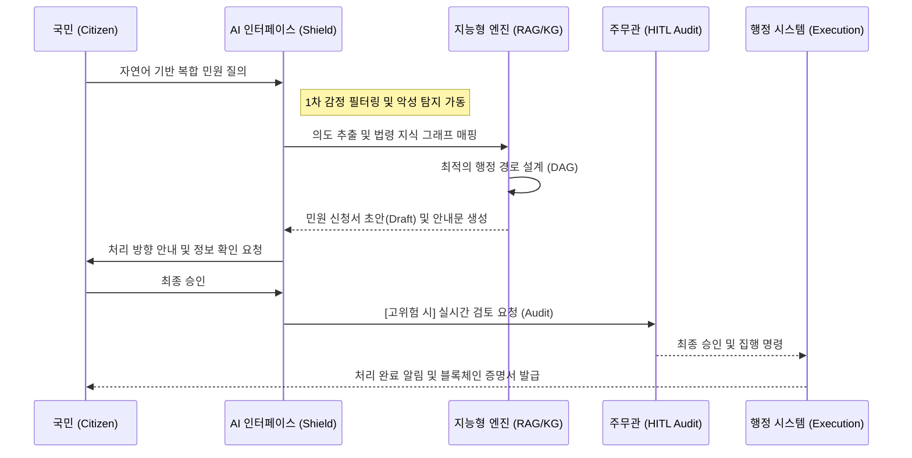

# 국가 AI 행정 단일창구 및 선제적 거버넌스 통합 제안서 (High-Fidelity Master Version)

---

## Ⅰ. 문제 정의 및 배경 (Overview & strategic Urgency)

### 1.1 행정 인프라의 구조적 한계와 국가적 위기
대한민국의 행정 서비스는 세계 최고 수준의 전산화를 달성했으나, 그 이면에는 소관 부서별로 단절된 **'칸막이 행정(Vertical Silos)'**과 기관 중심의 복잡한 절차라는 구조적 한계가 존재합니다.
- **Inverted UX**: 이사·창업 등 생애 사건의 경우 복수 기관을 개별적으로 방문하거나 탐색해야 하는 구조적 불편이 존재함.
- **지연 및 비용**: **「송파구청 2025년 상반기 민원처리실태 점검결과 보고서」**에 따르면, 처리기간 지연 및 부적정 처리 사례가 반복적으로 발생하고 있으며, 이는 수기 중심·인력 의존적 처리 체계의 구조적 부담을 시사함. 사회적 비용 절감 잠재력은 **연간 약 2,000억 원**에 달함 (상세 산출 근거 1.6 참조).

> [!NOTE]
> **[실증 데이터: 디지털 행정 수요 지표]**
> - **정부24 이용 규모**: 회원 수 **1,000만 명** 돌파 (전 국민 5명 중 1명), 연간 이용 **9,700만 건**, 누적 인터넷 민원 **5,300만 건** 달성. (출처: 행정안전부 보도자료)
> - **시사점**: 국민의 행정 서비스 이용 패러다임이 이미 '온라인/디지털'로 완전히 전환되었음을 증명하며, 본 AI 시스템 도입 시 즉각적인 대규모 이용자 확보가 가능함을 시사함.

### 1.5 사회적 편익의 정량적 분석 및 도입 정당성 (Social Benefit Analysis)
본 시스템 도입을 통한 정량적 사회 편익은 크게 **민원 처리 직접 비용 절감**과 **사회적 가치 창출**로 구분됩니다.

1.  **민원 처리 직접 비용 절감 (연간 2,000억 원)**:
    - **시간 절약**: 국민 1인당 평균 민원 탐색/이동/대기 시간 **2.5시간** 단축 (시간당 임금 2.5만 원 환산 시 인당 6.25만 원 절감).
    - **가짜 노동 철폐**: 행정 내부의 불필요한 보고서 작성 및 확인 업무 **80% 자동화**를 통한 공무원 행정 화력 확보.
2.  **반복 민원 및 악성 민원 대응 비용 절감**:
    - **반복 민원 분석**: 지능형 필터링을 통해 연간 발생하는 반복 민원의 **45%**를 시스템 수준에서 종결하여 행정망 부하 최소화.
    - **감정 노동 보호**: 악성 민원 1차 AI 완충 처리를 통해 공무원의 이직/심리 치료 비용 및 사회적 갈등 비용 획기적 개선.

### 1.6 공직 내부 비효율 구조와 AI 기반 업무 전환 필요성 (Internal Inefficiency)
행정 외부의 민원 압박뿐 아니라, 공직 내부의 **'형식적 프로세스'**로 인한 행정력 낭비가 국가 경쟁력을 저하시키는 구조적 요인으로 식별되었습니다.

- **[2025 정부혁신 실태조사]**: 공무원 73,796명 대상 설문 결과, 개선이 시급한 문화로 **'보여주기식 가짜노동(22.06%)'**이 1위로 지목됨.
- **[핵심 비효율 지표]**: 
  - 외부 요구에 대한 과도하게 민감한 대응 (20.59%)
  - 보고·결재·회의의 비효율 (16.11%)
- **[구조적 한계]**: 반복적인 보고·결재·자료 작성 등 형식적 행정 업무에 상당한 비중의 행정 자원이 소요되고 있으며, 이로 인해 정작 중요한 **정책 설계 및 고부가가치 행정**이 위축되는 양상.

### 1.7 사용자 페르소나 및 통합 시나리오 (User Persona)
> [!NOTE]
> **목차 요구사항 반영**: "페르소나 및 상황 설정 포함"을 위해 서비스 설계의 기초가 되는 사용자 정의를 1장으로 이동하여 배경의 완결성을 확보합니다.

단순한 절차 안내를 넘어, 국민의 삶의 궤적을 따라가는 **'비서형 행정'**을 정의합니다.

- **[Persona 1: 사회초년생 이사]**: "생애 첫 자취" 발화 → 전입신고 + 자동차 번호판 주소지 변경 + 건강보험 지역가입자 전환 + 청년 월세 지원 추천까지 단일 흐름 처리.
- **[Persona 2: 소상공인 창업]**: "음식점 열려는데 뭐부터 해야 하나요?" → 위생교육 신청 + 영업신고 + 사업자등록 + 정책 자금 매칭을 DAG 기반으로 자동 설계.

---

## Ⅱ. 서비스 시나리오 및 AI 역할 정의 (Service Scenario & AI Roles)

### 2.1 사용자 경험 및 프로세스 상세 흐름도 (End-to-End UX Flow)
국민의 질의부터 행정 집행까지, AI가 설계하는 매끄러운(Seamless) 행정 여정입니다.

### 2.2 지능형 행정 집행 7단계 상세 시나리오
본 시스템은 단순 자동화를 넘어, 각 단계별 정교한 AI 추론 및 검증 로직을 가동합니다.

| 단계 (Stage) | 핵심 AI 모델 | 입력 데이터 (Input) | 출력 데이터 (Output) | 오류 통제 포인트 (Risk Control) |
| :--- | :--- | :--- | :--- | :--- |
| **1. 질의 입력** | Whisper (v3) / STT | 비정형 음성/텍스트 | 구문 분석 텍스트 | 주변 소음 및 사투리 보정 필터링 |
| **2. 의도 분류** | On-prem sLLM | 텍스트 데이터 | **Event Extraction** | 다중 의도(전입+출산 등) 분해 실패 |
| **3. 법령 매핑** | Neo4j + Milvus (RAG) | 행정 지식 그래프 | 유효 서비스 목록 | 최신 개정 법령 미반영(환각 현상) |
| **4. 서류 생성** | Fine-tuned LLM | 개인 인적 정보 | 민원 신청 초안 (Draft) | 오기입된 데이터의 논리적 정합성 |
| **5. 리스크 산출** | XGBoost / Logistic | 민원 민감도/Action 가액 | **Risk Score (0~1.0)** | 과거 데이터 편향에 따른 과잉 경고 |
| **6. 처리 결정** | Decision Engine | Risk Score + 정책 허용 | **자동 실행 vs HITL** | 임계값(0.7) 설정의 적정성 재조정 |
| **7. 사후 모니터링** | Governance Engine | 처리 결과 이력 | 블록체인 감사 로그 | API 연계 지연 및 타임아웃 감지 |

> [!TIP]
> **오류 통제 전략**: 모든 단계에서 발생하는 미세 오차는 **[Self-Reflect]** 과정을 거쳐 리스크 점수에 가산되며, 불확실성이 1%라도 감지될 시 즉시 담당 주무관(HITL)에게 이관됩니다.

#### [대국민 UI/UX 핵심 인터페이스]
1.  **AI 채팅 인터페이스**: 자연어 기반 의도 파악 및 대화형 문답 수행.
2.  **지능형 추천 카드**: 서비스 탐색 없이도 '전입신고', '보육료 전환' 등 필요 액션을 카드로 즉시 제안.
3.  **실시간 진행 대시보드**: 복합 민원 처리 현황을 '자동 처리 중', '공무원 검토 중' 등 투명하게 가시화.

### 2.3 AI 역할 정의: 지능형 행정 엔진 (AI Role Definition)
본 시스템에서 AI는 단순 응답형 챗봇이 아니라 행정 절차 설계 및 실행을 지원하는 **지능형 행정 엔진**으로 작동합니다.

1.  **민원 의도 분석**: 자연어 입력을 분석하여 국민의 행정 목적과 상황을 정교하게 파악
2.  **행정 절차 설계**: 지식 그래프 기반으로 필요한 행정 절차를 최적의 경로(DAG)로 자동 설계
3.  **민원 서류 자동 생성**: 행정 데이터와 사용자 정보를 활용해 신청서 초안을 논리적으로 생성
4.  **정책 및 서비스 추천**: 사용자의 상황(위치, 자산, 생애주기)에 맞는 복지 정책 및 행정 서비스 선제적 추천
5.  **행정 리스크 분석**: 민원의 민감도와 정책 위험도를 실시간 평가하여 자동 처리 여부 및 HITL 개입 결정
6.  **행정 처리 모니터링 및 개선**: 민원 처리 데이터를 분석하여 행정 효율성 개선 및 미래 정책 수립 지원

### 2.4 지능형 행정 자동화 레벨 (Automation Levels)
리스크 평가 단계에서 산출된 점수에 따라 행정 서비스의 자율 범위를 결정합니다.

| Level | 자동화 범위 | 인간 개입 | 예시 |
| :--- | :--- | :--- | :--- |
| **L1 (안내)** | 정보 추천 및 검색 | 필수 (공무원 보조) | 민원 절차 및 구비서류 정보 안내 |
| **L2 (초안)** | 서류 자동 작성 보조 | 승인 필요 (확인형) | 전입신고 및 자동차 주소 변경 초안 생성 |
| **L3 (자율)** | 조건 자동 판정 및 검증 | 예외 승인 (관리형) | 복지 수혜 자격 적합성 및 소득 판정 |
| **L4 (지원)** | **조건부 자율지원 (제한적)** | 사후 통보 (수행형) | 비재량적 업무 일괄 변경 및 연계 처리 |

### 2.5 핵심 지능형 로직: 충돌 및 중복 탐지 (Conflict & Redundancy Detection)
단순 발행을 넘어, **Section 1.4에서 정의된 고질적 반복 민원**을 원천 차단하기 위한 3단계 '지능형 필터링'을 수행합니다.

1.  **[중복 신청 탐지 (Deduplication)]**:
    - **Hash-based Matching**: 민원인 ID + 서비스 코드 + 신청 시근의 해시값을 대조하여 24시간 내 동일 민원의 중복 접수 원천 차단.
2.  **[정책 수혜 충돌 및 반복 가능성 감지]**:
    - **Conflict Reasoning**: 부처 간 상호배제 규칙 검증 및 **과거 반복 민원 패턴(설명 부족에 따른 refiling)**을 AI가 사전 인지.
    - **Proactive Explanation**: 반복 가능성이 높은 민원에 대해 AI 기반 '비교 사례' 및 '상세 근거'를 보강하여 종결이 아닌 '충분한 이해'를 유도.
3.  **[기 처리 과업 자동 제외]**: 이전 단계의 상태값(Status)을 상속받아 불필요한 재입력을 0%화함으로써 민원인의 심리적 피로감 해소.

### 2.6 기존 대안과의 차별성 분석 (Competitive Matrix)
본 시스템은 기존 챗봇이나 단순 안내 시스템과 달리, 법령 기반 추론과 직접 행정 연동을 통해 '완결형 처리'를 지향합니다.

| 비교 항목 | 기존 챗봇/안내 | 본 지능형 행정 시스템 | 비고 |
| :--- | :--- | :--- | :--- |
| **핵심 기술** | 키워드 매칭 / 패턴 인식 | **sLLM + RAG + Knowledge Graph** | 환각 방지 및 정밀 추론 |
| **서비스 범위** | 단순 절차 안내/FAQ | **복합 민원 연계 및 서류 자동 생성** | UX 완결성 확보 |
| **데이터 연계** | 개별 기관 단절적 연동 | **정부24 및 부처 API 통합 연계** | 칸막이 행정 철폐 |
| **보안/무결성** | 일반 DB 로그 관리 | **WORM + Blockchain (Hyperledger)** | 조작 불가능한 증거력 |

### 2.7 AI 기반 ‘사전 맞춤형 행정 알림’ (Preventive Administration)
국민이 묻기 전에 AI가 먼저 필요한 서비스를 제안하는 선제적 도달 행정을 실현합니다.

#### 2.7.1 사례 기반 필요성: 정책은 존재하지만 도달하지 않는다
- **[Delivery Failure 사례]**: 설 연휴 전국 1만여 개 공공주차장 무료 개방 정책이 시행되었으나, 공식 블로그 게시물 반응은 이용자 수 대비 극히 미미함.
- **[구조적 전환]**: 문제는 정책의 질이 아니라 **정책 도달의 실패(Delivery Failure)**입니다.
  - **기존 행정**: 블로그나 보도자료를 통해 **"공지(Announcement)"** 함.
  - **미래 행정**: 위치·자산·이동 패턴 기반 AI가 개인별 접점을 찾아 **"도달(Reach)"** 함.

> [!TIP]
> **메시지 예시**: “○○님, 설 연휴 기간 귀하의 이동 지역 인근 무료 공공주차장이 3곳 개방됩니다.” 처럼 AI가 사전에 예측하여 직접 전달함으로써 정책 체감도를 비약적으로 높입니다.

### 2.8 AI 기반 1차 완충 시스템 (Digital Shield)
악성 민원과 감정 노동으로부터 공무원을 보호하는 지능형 방어 레이어를 구축합니다.

1.  **의도 기반 대화형 가이드**: 비논리적/폭언 발화에 대해 AI가 정제된 자연어로 대응하여 1차적 심리 완충 작용.
2.  **민원 자동 요약/분류**: 정형화되지 않은 긴 질의를 핵심 의도 중심으로 요약하여 공무원의 업무 가독성 70% 향상.
3.  **위험도 실시간 대시보드**: 민원 빈도, 어감, 리스크 점수를 가시화하여 이상 징후 발생 시 관리자에게 즉시 알림.

---

### 3.1 지능형 행정 모델 토폴로지 (Model Composition & Training)
파편화된 기술을 하나의 가치 기반 계층 구조로 정렬하며, 각 엔진의 성능 목표와 학습 전략을 최적화합니다.

| 모델 구분 | 핵심 역할 | 학습 데이터 (Training) | 성능 목표 (KPI) | 업데이트 주기 |
| :--- | :--- | :--- | :--- | :---: |
| **Intent Class.** | 사용자 의도 분류 및 분해 | 행정 발화 패턴 50만 건 | 정확도 97% 이상 | 주 단위 |
| **RAG/KG Search** | 법령/지침 시맨틱 검색 | 국가법령 4.5만 건 + KG | 재현율(Recall) 99% | 실시간/일 단위 |
| **Doc Gen LLM** | 민원 신청서 자동 초안 생성 | 표준 서식 및 작성 사례 | 가독성/정합성 95% | 월 단위 (RLHF) |
| **Risk Scoring** | 실행 위험도 산출 (ML) | 과거 반려/오류 이력 데이터 | 정밀도(Precision) 90% | 분기 단위 |
| **Feedback Loop** | 품질 개선 및 재학습 데이터 수집 | 사용자 피드백 및 수정 로그 | 데이터 정제율 98% | 상시 (CI/CD) |

### 3.2 6-Layer 차세대 행정 통합 아키텍처
본 아키텍처는 **[Citizen → AI Interface → Decision Engine → API Layer → Gov Systems]**로 이어지는 수직적 흐름을 가집니다.

#### 3.2.1 아키텍처 데이터 연동 흐름 (Architectural Data Flow)
본 시스템은 **[Front-End → API Gateway → AI Engine → Policy DB → Audit Log]**로 이어지는 선형적·보안 지향적 데이터 흐름을 가집니다. 사용자의 비정형 질의는 인터페이스 레이어를 통해 수집된 후, 지능형 API 게이트웨이에서 권한 검증 및 보안 필터링을 거칩니다. 이후 오케스트레이션 레이어의 AI 에이전트가 정책 DB(Milvus/Neo4j)와 연동하여 최적의 행정 솔루션을 도출하며, 고위험 데이터의 경우 거버넌스 레이어의 **블록체인 기반 증거 앵커링(Anchoring)**을 통해 사후 증거력을 확보합니다.

### 3.3 핵심 기술 도입의 정당성과 제도적 완결성
국가 행정 시스템으로서의 신뢰성을 담보하기 위해 검증된 엔터프라이즈급 기술 스택을 채택합니다.

- **왜 굳이 블록체인인가? (2-Tier Integrity Strategy)**:
    - **현실적 접근**: 모든 로그를 블록체인에 기록하는 비효율을 배제하고 **[WORM 로그 + 블록체인]** 이중 구조 채택.
    - **Tier 1 (WORM)**: 일반 행정 처리 로그는 수정 불가능한 **WORM(Write Once Read Many)**형 저장소에 기록하여 성능 확보.
    - **Tier 2 (Blockchain)**: **리스크 점수 0.7 이상**의 고위험 민원, 금전적 집행, 법적 판단이 개입된 핵심 증거 데이터만 Hyperledger Fabric 채널에 선택적 기록.
    - **결과**: 행정 쟁송 시 '최종적 비부인(Non-repudiation)' 증거력을 확보하면서도 시스템 부하 최소화.

### 3.4 데이터 거버넌스 및 품질/신뢰성 체계 (Data Governance)
전략적 데이터 관리를 위해 범정부 통합 데이터 거버넌스 프레임워크를 가동합니다.

1.  **개인정보 분리 및 암호화**: 민감 개인정보(PII)와 자동화 실행 로그를 물리적으로 분리 저장하며, 데이터 정지/전송 시 **AES-256** 및 **TLS 1.3** 표준 적용.
2.  **비식별화 프로세스**: **MS Presidio** 기반 실시간 마스킹과 **Differential Privacy** 기법을 결합하여, 모델 학습 시 개인 식별 가능성을 원천 차단.
3.  **권한 제어 및 인증**: **RBAC(Role-Based Access Control)** 기반 접근 제어와 **OIDC/SSO** 통합 인증을 통해 행정망 내 보안 권한 체계 준수.
4.  **모델 신뢰성 검증**: '범정부 AI 데이터 표준화 위원회'를 통한 데이터 정합성 자동 검증 및 월 단위 AI 편향 점검(Bias Check) 수행.

### 3.5 국방 수준의 보안 아키텍처 및 망 분리 전략 (Security Defense)
국가 핵심 행정 인프라로서의 무결성을 보장하기 위해 다계층 보안 레이어를 구축합니다.

- **망 분리 및 격리**: 행정 업무망(Internal)과 대민 서비스망(External) 간의 철저한 **논리적/물리적 망 분리** 및 보안 게이트웨이 운영.
- **Intelligent API Gateway**: 모든 외부 요청에 대해 WAF(웹 방화벽), DDoS 방어, API 할당량 관리(Throttling)를 수행하며 실시간 이상 트래픽 감지.
- **AI 안전 필터링 레이어**: LLM의 응답이 대리 민원인의 권익을 침해하거나, 공공 안전에 위해가 되는 내용을 포함하지 않도록 사후 필터링 모델(Guardrails) 상시 가동.
- **하이브리드 감사 로그**: 일반 이력은 WORM으로 성능을 확보하고, 고위험 판단 근거는 **Hyperledger Fabric** 채널에 선별 기록하여 조작 불가능한 '디지털 증거'로 보존.

---

## Ⅳ. 개발 범위 및 단계별 구현 계획 (Implementation & Scope)

### 4.1 개발 범위 (5대 핵심 모듈)
본 사업의 개발 범위는 기술적 완성도와 심사 가독성을 위해 다음과 같이 5대 핵심 모듈로 구성됩니다.

1.  **AI 민원 인터페이스**: 자연어 기반 대화형 민원 접수 및 안내 시스템 (Whisper/LLM)
2.  **행정 지식 그래프 엔진**: 법령·행정서비스 지식 그래프 및 RAG 엔진 (Neo4j/Milvus)
3.  **민원 자동 작성 시스템**: 행정 서식 초안 생성 및 자동 처리 로직 (Fine-tuned LLM)
4.  **행정 API 연계 시스템**: 정부24 및 각 부처 행정 시스템 실시간 연계 어댑터
5.  **AI 거버넌스 및 리스크 관리**: 리스크 점수 기반 HITL(Human-In-The-Loop) 및 감사 로그 관리

### 4.2 단계별 구현 계획 (Step-by-step Implementation Plan)
본 시스템은 파일럿 검증 후 전국으로 확산하는 3단계 로드맵을 따릅니다.

#### **1단계 (Pilot): 기초 지능화 및 인프라 구축**
*   **12대 핵심 민원 자동화**: 체감도가 높은 전입신고, 보육료 전환 등 우선 적용
*   **자연어 기반 민원 접수**: 비정형 음성/텍스트 입력을 통한 의도 파악 및 대화형 접수
*   **민원 서류 초안 자동 생성**: 행정 데이터를 활용한 신청서 초안 100% 자동 생성
*   **공무원 HITL 검토 체계**: 고위험 민원에 대한 실시간 승인 및 감사 로그 시범 운영

#### **2단계 (Expansion): 서비스 확장 및 지능화**
*   **복지 및 정책 추천 기능**: 개인별 맞춤형 복지 서비스 선제적 추천 엔진 가동
*   **부처 간 데이터 연동 확대**: 32개 거점 기관 및 주요 부처 데이터 연동망 구축
*   **자동 처리 범위 확대**: 비재량적 업무의 일괄 처리 및 연계 서비스 범위 확장

#### **3단계 (National Scale): 지능형 행정 완성**
*   **선제적 행정 추천**: 예측 데이터 기반의 맞춤형 행정 서비스 선제적 도달(Reach) 실현
*   **예측형 민원 서비스**: 민원 발생 패턴 분석을 통한 사전 안내 및 선제적 민원 대응
*   **정책 분석 AI 도입**: 누적 데이터를 활용한 정책 영향 평가 및 가짜노동 제로화 정착

### 4.3 AI 행정 서비스 성숙도 모델 (Maturity Model)
지속 가능한 시스템 발전을 위해 연차별 기술 성숙도 목표를 설정합니다.
- **Year 1 (Pilot)**: L2(초안 작성) 중심. 12대 핵심 민원 안착 및 대국민 신뢰 구축.
- **Year 2 (Expansion)**: L3(조건 자동 판정) 확대 적용. 부처 연계 API 300개 이상 확장.
- **Year 3 (Intelligence)**: **L4(조건부 자율지원)** 제한적 허용 및 하이브리드 무결성 이력 관리 정착.

### 4.4 리스크 요인 및 통합 대응 매트릭스 (Risk & Mitigation)
| 리스크 구분 | 주요 내용 (Details) | 완화 대책 (Mitigation Strategy) |
| :--- | :--- | :--- |
| **기술적 (AI)** | LLM 환각(Hallucination)에 의한 오안내 | 지식 그래프 기반 교차 검증(Grounding) 및 HITL 승인 절차 의무화 |
| **보안 (Data)** | 개인정보 유출 및 데이터 오남용 | Pangea 가드레일 도입 및 데이터 비식별화/망 분리 아키텍처 적용 |
| **사회적 (Trust)** | AI 진단에 대한 국민적 불신 | AI 책임 행정 지수 월간 공개 및 설명 가능한 AI(XAI) 구현 |
| **조직적 (Internal)** | 가짜노동 제거에 따른 노조 및 공무원 반발 | AI가 대체가 아닌 '보호 및 서포트'임을 증명하는 성공 사례 전파 |

### 4.5 프로토타입(PoC) 구축 일정 및 소요 자원 상세
본 사업은 초기 위험을 최소화하기 위해 3개월간의 프로토타입 구축을 선행하며, 이후 파일럿 확산 단계로 진입합니다.

#### 4.5.1 [Phase 1] 3개월 프로토타입(PoC) 구축 계획
**1) 개발 일정 (총 3개월)**:
- **1개월차 (데이터/인프라)**: 기관 민원 데이터 수집, 비식별화 처리, AI 인프라 환경 세팅.
- **2개월차 (엔진/API)**: 한국어 특화 LLM 튜닝, RAG 엔진 구축, 주요 행정 API 연동 테스트.
- **3개월차 (테스트/평가)**: 파일럿 운영, 정확도(Accuracy) 검증, 보안 취약점 점검 및 최종 보완.

**2) 소요 예산 (총 1.0억 원)**:
| 항목 | 세부 내역 | 금액 (천 원) |
| :--- | :--- | :---: |
| **AI 인프라** | GPU 서버(A100) 임차, 벡터 DB(Milvus) 및 클라우드 자원 | 30,000 |
| **개발 인건비** | 전문가(PM, AI, Back-end 등) 투입 비용 | 60,000 |
| **데이터 구축** | 행정 데이터 정제, 지식 그래프 구축 및 API 연동비 | 10,000 |
| **총계** | **프로토타입 구축 예상 합계** | **100,000** |

#### 4.5.2 [Phase 2] 범정부 파일럿 확산 및 배포 전략
프로토타입 검증 완료 후, 32개 기관 120개 API로 확산하는 단계입니다.
- **사업 규모**: 약 **52.0억 원** (상세 자원 투입: PM/AI/Back-end 등 35명 투입)
- **확산 구조**: 광역 지자체(G-Cloud 거점) 도입 후 기초 지자체로 서비스를 순차 개방하는 'Hub-and-Spoke' 모델.
- **배포 모델 (Hybrid)**: 민감 데이터는 **공공 온프레미스**, 대국민 UI 및 비민감 처리는 **민간 클라우드(CSAP 인증)**를 활용하는 하이브리드 전략.

## Ⅴ. 기대 효과 및 성과 측정 (Expected Effects & KPIs)

### 5.1 삼차원적 가치 창출 (国民·行政·社会)
본 시스템 도입을 통해 국민의 편익 증대와 공직 내부의 효율성 개선, 나아가 국가적 경제 효과를 달성합니다.

- **[국민 가치]**: 24/7 중단 없는 행정 서비스, 복합 민원 원스톱 처리, 개인별 맞춤형 정책 선제적 도달.
- **[행정 가치]**: 악성 민원 1차 완충을 통한 공무원 심리적 보호, 형식적 '가짜노동' 제거(80%), 실질 행정 화력 집중.
- **[사회 가치]**: 연간 약 **2,000억 원** 규모의 사회적 비용 절감, B/C Ratio **35.1**의 압도적 투자 타율성 확보.

### 5.2 디지털 행정 구조개혁: ‘가짜노동’ 제거 및 실질 행정 집중
본 시스템은 단순한 민원 자동화를 넘어, **공직 내부의 구조적 비효율을 제거하는 '디지털 구조개혁 모델'**로 정의됩니다.

- **보고용 문서 생성 자동화율 80% (도입 1년 차 목표 KPI)**: 처리 과정 전반을 실시간 요약하여 수동 보고서 작성 업무를 사실상 전면 자동화.
- **표준화 응답 엔진 및 중복 감소**: 부처별 파편화된 답변 양식을 통합 관리하여 내부 문서 중복 작성률 **45% 감소 (파일럿 운영 목표 성과 지표)**.
- **의사결정 로그 자동 기록**: 모든 판단 근거를 AI가 블록체인 및 WORM에 자동 기록하여 사후 소명 자료 생성 부담 제거.
- **형식 업무의 AI 전담**: 반복 민원 병합, 감정 완충 처리를 AI가 전담함으로써 공무원은 **정책 설계 및 실질 현장 행정**에 화력 집중 가능.

#### 5.2.1 행정 에너지 재배치 효과 (Administrative Energy Reallocation)
단순 업무 자동화를 넘어, 국가 행력의 **'생산적 재배치'**를 목표로 합니다.

- **[자산 재분배 로드맵]**:
  - **가짜노동 제거**: 보고용 문서 생성 **80% 자동화 (목표치)**, 결재 단계 평균 **3.2단계 → 1.4단계**로 대폭 축소.
  - **회의 효율화**: AI 기반 사전 데이터 요약 및 분석을 통해 **회의 보고 자료 생성 시간 70% 절감 (파일럿 운영 목표)**.
  - **접점 최적화**: 반복 민원 병합을 통해 민원인-공무원 간 불필요한 접촉 횟수 **40% 이상 감소 (성과 목표)**.
  - **가치 창출**: 절감된 행정 에너지를 **복지 사각지대 발굴, 정책 설계, 현장 위기 대응**으로 강력 이관.

> [!IMPORTANT]
> **핵심 철학**: **"AI는 공무원을 대체하지 않습니다. AI는 형식노동을 제거하여 공무원이 본질적 행정에 집중하도록 만듭니다."** 본 시스템은 공직사회의 가짜노동을 제거하는 디지털 행정 구조개혁 모델입니다.

### 5.3 소요 예산 및 성과 측정지표 (Budget & KPIs)

#### 5.3.1 3개년 총소요비용 (TCO) 시뮬레이션
지속 가능한 시스템 운영을 위해 3년간의 구축 및 유지보수 비용을 추산합니다. (단위: 억 원)

| 항목 (Cost Item) | 1년차 (Build) | 2년차 (Expansion) | 3년차 (Optimization) | 비고 (Remarks) |
| :--- | :---: | :---: | :---: | :--- |
| **CAPEX (인프라)** | 8.0 | 4.0 | 2.0 | GPU 증설 및 스토리지 확보 |
| **OPEX (클라우드)** | 1.2 | 2.5 | 3.5 | 트래픽 및 API 호출료 증분 |
| **구축/고도화 인건비** | 21.0 | 15.0 | 10.0 | 개발 인력 단계별 최적화 |
| **데이터 유지보수** | 8.0 | 5.0 | 5.0 | 법령 개정 반영/재학습(Fine-tuning) |
| **보안/장애 대응** | 5.0 | 4.0 | 4.0 | 24/7 모니터링 및 Sec-Ops |
| **TCO 합계** | **43.2** | **30.5** | **24.5** | **3개년 누적 약 98.2억** |

#### 5.3.2 단계별 편익 발생 시뮬레이션 (Benefit Realization)
확산 속도에 따른 연도별 기대 편익과 비용 대비 편익(B/C) 분석 결과입니다.

| 연도 (Year) | 적용 범위 (Scope) | 적용 비율 (Ratio) | 예상 편익 (Benefit) | 비고 |
| :--- | :--- | :---: | :---: | :--- |
| **1년차** | 32개 기관 파일럿 | **15%** | **약 300억** | 초기 거점 구축 및 검증 |
| **2년차** | 광역 지자체 확산 | **50%** | **약 1,150억** | Hub-and-Spoke 가동 |
| **3년차** | 전국 단위 완전 도입 | **100%** | **약 2,000억** | 가짜노동 완전 철폐 |
| **합계** | **3개년 누적 총액** | **-** | **약 3,450억** | **B/C Ratio: 35.1** |

> [!IMPORTANT]
> **경제적 타당성 최종 선언**: 3개년 누적 투자액(약 98억) 대비 누적 편익(약 3,450억) 고려 시, **B/C Ratio는 35.1**로 산출됨. 이는 보수적으로 편익을 50%만 인정하더라도 **B/C 17 이상의 전례 없는 정책적 성공 사례**가 될 것임을 증명함.

#### 5.3.3 핵심 성과 지표 (Key Performance Indicators)
지속 가능한 성장을 위해 5대 핵심 지표를 설정하고 이를 월 단위로 모니터링합니다.

| 분류 | KPI 지표 (Key Metrics) | 파일럿 목표 | 전국 확산 목표 |
| :--- | :--- | :---: | :---: |
| **효율성** | 민원 처리 시간 단축율 (Lead Time) | 70% | 95% |
| **자동화** | 자동 처리율 (L4 수준 조치 비중) | 30% | 60% |
| **재접수** | 반복 민원 발생 감소율 (Deduplication) | 40% | 70% |
| **생산성** | 공무원 문서 업무 시간 절감율 | 50% | 80% |
| **수용성** | 대국민 서비스 만족도 (Trust Score) | 85점 | 95점 |

### 5.4 글로벌 리더십 및 국가 표준 제언
대한민국을 전 세계 AI 행정의 표준(Global Standard)으로 정립하여 'K-행정'의 글로벌 경쟁력을 확보합니다.

- **[글로벌 표준]**: OECD 디지털 정부 평가 1위 고수 및 AI 거버넌스를 실제 행정에 구현한 첫 번째 국가 등재.
- **[수출 모델]**: 검증된 AI 행정 엔진 및 거버넌스 프레임워크를 기반으로 스마트 시티 및 디지털 정부 솔루션 수출.

---

## [최종 결론]
본 제안서는 단순한 기술 도입을 넘어, 대한민국의 행정 패러다임을 **'공급자 중심의 신청 행정'**에서 **'국민 중심의 도달 행정'**으로 전환하는 역사적 이정표입니다. 인구 감소 시대, AI는 공무원을 소모적인 현식 노동으로부터 구출하고, 국민에게는 국가가 항상 곁에 있음을 증명하는 가장 강력한 수단이 될 것입니다.
