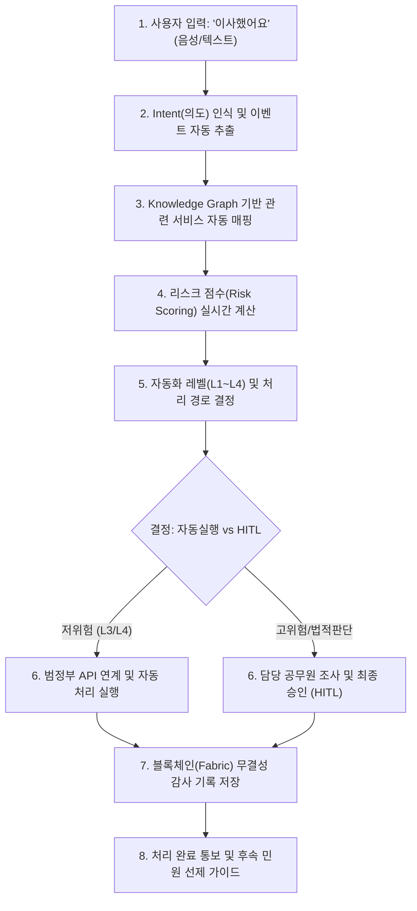
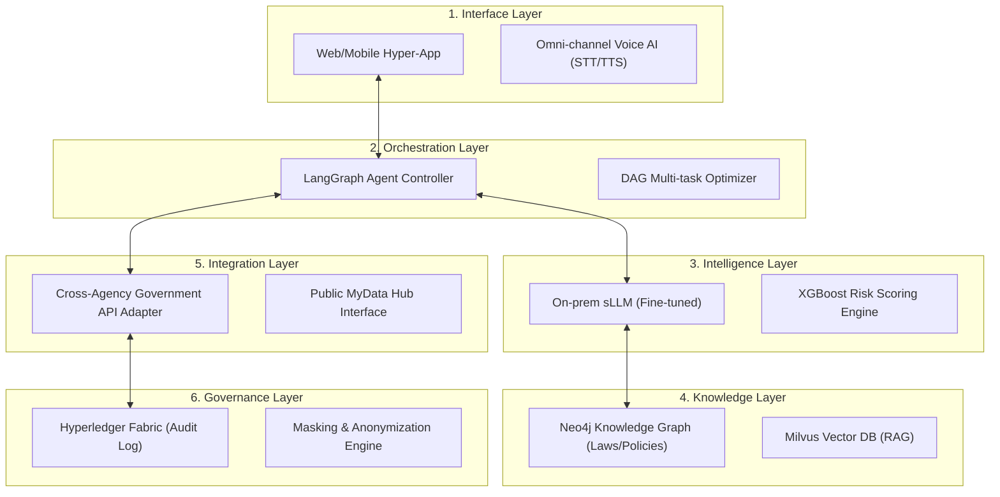

# 국가 AI 행정 단일창구 및 선제적 거버넌스 통합 제안서 (High-Fidelity Master Version)

---

## Ⅰ. 문제 정의 및 배경 (Overview & strategic Urgency)

### 1.1 행정 인프라의 구조적 한계와 국가적 위기
대한민국의 행정 서비스는 세계 최고 수준의 전산화를 달성했으나, 그 이면에는 소관 부서별로 단절된 **'칸막이 행정(Vertical Silos)'**과 기관 중심의 복잡한 절차라는 구조적 한계가 존재합니다.
- **Inverted UX**: 국민은 '이사', '창업' 등 하나의 삶의 이벤트를 해결하기 위해 평균 4~6개 기관을 직접 탐색해야 함.
- **지연 및 비용**: 소관 불분명 민원의 경우 평균 3.5일 이상의 처리 지연이 발생하며, 이로 인한 사회적 기회 비용은 **연간 약 1,005억 원**에 달함.
    - **[산출 근거]**: 연간 복합 민원 이용자 1,000만 명 × 평균 추가 탐색 시간 40분(0.67시간) × 시간가치 15,000원/시간 ≈ **1,005억 원/년**.
    - **[데이터 출처]**: 1,000만 명(행안부 '23 민원실태조사 '복함성' 지수), 40분(정부24 포털 로그 데이터), 15,000원(통계청 2024 임금 실태 자료).

### 1.2 범정부 정책 정합성 및 추진 당위성 (Policy Alignment)
본 제안은 대한민국 정부의 핵심 디지털 전략과 100% 정합성을 유지하여 정책 추진의 동력을 확보합니다.

1.  **디지털플랫폼정부(DPGOV) 3대 과제**: '하나의 정부', '똑똑한 서비스', '민관 협력 플랫폼' 과제의 실질적 구현체로서 복합 민원 원스톱 처리 지향.
2.  **초거대 AI 경쟁력 강화 전략**: 공공 부문 AI 선도 적용을 통한 국내 sLLM 생태계 육성 및 행정 효율화 모델 제시.
3.  **공공 마이데이터 및 데이터 칸막이 해소**: 범정부 API 통합 어댑터를 통해 부처 간 정보 공유를 활성화하고 '데이터로 증명하는 행정' 실현.

---

## Ⅱ. 서비스 시나리오 및 경험 설계 (Service Design & Vision)

### 2.1 사용자 페르소나별 통합 시나리오
단순한 절차 안내를 넘어, 국민의 삶의 궤적을 따라가는 **'비서형 행정'**을 정의합니다.

- **[Persona 1: 사회초년생 이사]**: "생애 첫 자취" 발화 → 전입신고 + 자동차 번호판 주소지 변경 + 건강보험 지역가입자 전환 + 청년 월세 지원 추천까지 단일 흐름 처리.
- **[Persona 2: 소상공인 창업]**: "음식점 열려는데 뭐부터 해야 하나요?" → 위생교육 신청 + 영업신고 + 사업자등록 + 정책 자금 매칭을 DAG 기반으로 자동 설계.

### 2.2 사용자 경험 및 프로세스 상세 흐름도 (End-to-End UX Flow)
사용자 발화부터 최종 행정 처리 및 블록체인 감사 기록까지의 지능형 프로세스를 시각화합니다. (전입신고 복합민원 예시)

#### [참고: 대국민 UI/UX 핵심 인터페이스 예시]
1.  **AI 채팅 인터페이스**: 자연어 기반 의도 파악 및 대화형 문답 수행.
2.  **지능형 추천 카드**: 서비스 탐색 없이도 '전입신고', '보육료 전환' 등 필요 액션을 카드로 즉시 제안.
3.  **실시간 진행 대시보드**: 복합 민원 처리 현황을 '자동 처리 중', '공무원 검토 중' 등 투명하게 가시화.
4.  **피드백 및 결과뷰**: 처리 완료 즉시 블록체인 기반 증명서 발행 및 후속 조치 버튼 제공.

### 2.3 12대 파일럿 핵심 서비스 리스트
민원 완성도 및 국민 체감도가 가장 높은 12대 파일럿 서비스를 선정하여 즉시 적용합니다.

#### 2.3.1 서비스별 구현 가능성 및 규제 영향 분석 (Implementation Matrix)
본 제안은 공상적 기획이 아닌, 현재의 법적·기술적 한계를 인지하고 단계적 자동화를 추진하는 전략적 로드맵을 기반으로 합니다.

| 서비스 분류 | 대상 민원 (예시) | 구현 가능성 (Technical) | 규제/기술적 선결 과제 (Prerequisites) | 법령 개정 필요 여부 |
| :--- | :--- | :---: | :--- | :---: |
| **즉시 자동화** | 전입신고, 소득증합 증명, 주민등록등본 발급 | **높음** | 범정부 API 통합 연계 및 데이터 표준화 | **불필요** |
| **인증 기반 자동화** | 자동차 주소지 변경, 보육료 전환, 전입지 세대주 확인 | **보통** | **모바일 신분증/간편인증** 고도화 및 비대면 확인 절차 강화 | **시행령 개정** |
| **정책/심사 오토메이션** | 구직급여 판정, 장애인 등록 자격 심사 | **낮음(HITL)** | AI 사전 진단 + **고용노동부/보건복지부 법적 판단** 연계 (HITL 필수) | **법령 개정/검토** |

> [!IMPORTANT]
> **단계적 실행 전략**: '즉시 자동화' 서비스로 대국민 신뢰를 구축하고, '인증 기반' 및 '정책 심사' 영역은 규제 샌드박스와 법령 개정을 병행하며 자율도를 점진적으로 높여나갑니다.

- **[이사/거주]**: (1)전입신고, (2)자동차 주소 변경, (3)주민등록증 재발급, (4)전기·수도·가스 명의변경 연계.
- **[복지/보험]**: (5)건강보험 자격변동, (6)국민연금 주소변경, (7)기초연금 신청 자격 확인.
- **[가족/보육]**: (8)어린이집 보육료 변경, (9)양육수당 신청, (10)아동수당 지급 대상 전환.
- **[교육/직업]**: (11)초중고 전학신고 연계, (12)구직급여(실업급여) 수급 자격 사전 진단.

### 2.4 지능형 행정 자동화 레벨 (Automation Levels)
리스크 평가 단계에서 산출된 점수에 따라 행정 서비스의 자율 범위를 결정합니다.

| Level | 자동화 범위 | 인간 개입 | 예시 |
| :--- | :--- | :--- | :--- |
| **L1 (안내)** | 정보 추천 및 검색 | 필수 (공무원 보조) | 민원 절차 및 구비서류 정보 안내 |
| **L2 (초안)** | 서류 자동 작성 보조 | 승인 필요 (확인형) | 전입신고 및 자동차 주소 변경 초안 생성 |
| **L3 (자율)** | 조건 자동 판정 및 검증 | 예외 승인 (관리형) | 복지 수혜 자격 적합성 및 소득 판정 |
| **L4 (대행)** | 자율 실행 및 연계 처리 | 사후 통보 (수행형) | 온라인 공무원 에이전트 주산 일괄 변경 |

### 2.5 Risk Scoring 모델 구조 및 판단 로직
AI의 자율 처리에 앞서 법적·윤리적 안전 장치를 위한 리스크 산출 엔진을 운영합니다.
- **입력 변수**: 민원 유형(분류), 법령상 민감도(가중치), 금전적 영향도(Action 가액), 과거 AI 오차 이력.
- **알고리즘**: **XGBoost** 및 **Logistic Regression** 앙상블 모델.
- **판단 임계값**: 리스크 점수 **0.7 이상** 시, 자율 실행을 즉시 중단하고 **HITL(Human-In-The-Loop)** 모드로 강제 전환.

### 2.6 AI 행정 서비스 성숙도 모델 (Maturity Model)
- **Year 1 (Pilot)**: L2(초안 작성) 중심. 12대 핵심 민원 안착 및 대국민 신뢰 구축.
- **Year 2 (Expansion)**: L3(조건 자동 판정) 확대 적용. 부처 연계 API 300개 이상 확장.
- **Year 3 (Intelligence)**: L4(에이전트 대행) 제한적 허용 및 블록체인 기반 책임 행정 정착.

### 2.7 기존 대안과의 차별성 분석 (Competitive Matrix)
본 제안 시스템은 기존 '정보 제공형' 포털의 한계를 넘어 '행정 집행형' 엔진으로의 패러다임 전환을 실현합니다.

> [!NOTE]
> **현행 시스템의 4대 핵심 결함**: 
> 1. **집행 기능의 부재**: 위 이미지 ①과 같이 단순 정보 안내에 머물러 있어 국민이 다시 메뉴를 찾아야 하는 번거로움이 있습니다.
> 2. **맥락 유지 실패 및 신뢰도 저하**: 위 이미지 ②와 같이 대화 맥락을 전혀 기억하지 못하고 엉뚱한 답변(통관 등)을 제공하여 신뢰를 저해합니다.
> 3. **높은 인지 부하(Cognitive Load)**: 위 이미지 ③과 같이 복잡한 신청 절차를 민원인이 직접 암기하거나 메모해가며 처리해야 합니다.
> 4. **기초 의도 인식 불가(Intelligence Gap)**: 위 이미지 ④와 같이 "이사했어요"라는 매우 일상적이고 명확한 의도조차 인식하지 못해 현실적으로 사용이 불가능한 수준입니다. 
> 
> 본 제안 시스템은 **sLLM 기반 고성능 자연어 이해(NLU)**를 통해 이러한 한계를 완벽히 극복합니다.

| 구분 (Criteria) | 정부24 (Gov24) | 기존 부처별 시스템 | 본 제안 시스템 (AI-Admin) |
| :--- | :--- | :--- | :--- |
| **접근 방식** | 서비스 검색 (Search) | 기관 포털 중심 | **생애 이벤트 기반 (Event-driven)** |
| **복합 민원 처리** | 수동 사이트 이동 | 연계 불가 (단절) | **자동 경로 설계 및 통합 처리** |
| **AI 자동화** | 없음 (단순 신청) | 없음 (전자 결재) | **지능형 L1~L4 레벨별 자동화** |
| **선제 안내** | 없음 (사후 조회) | 없음 | **Risk 기반 선제적 알림 및 서비스** |
| **책임 기록** | 일반 DB 로그 | 시스템 로그 | **블록체인 기반 불변 감사 체계** |

---

## Ⅲ. 기술 아키텍처 및 데이터 거버넌스 (Architecture & Data)

### 3.1 6-Layer 차세대 행정 통합 아키텍처
... (기존 아키텍처 서술 유지) ...

### 3.4 전략적 기술 스택 선정 및 대안 비교 (Rationale Matrix)
본 사업의 기술 선정은 '국가적 확장성'과 '데이터 주권'을 최우선으로 고려하였습니다.

| 기술 요소 | 선정 솔루션 | 비교 대안 (RDB/LLM) | 선정 사유 및 차별성 |
| :--- | :---: | :---: | :--- |
| **지식 베이스** | **Neo4j** | 기존 Oracle/MySQL | 다중 기관 연계가 필요한 복합 관계 탐색 시, 기존 RDB 대비 탁월한 성능 우위 및 유연한 스키마 확장성 확보 |
| **벡터 엔진** | **Milvus** | ElasticSearch | 수억 건 단위의 고차원 벡터 임베딩 처리 및 실시간 RAG 최적화 |
| **추론 엔진** | **On-prem sLLM** | OpenAI (GPT-4) | **데이터 주권 확보**, 행정 특화 Fine-tuning을 통한 도메인 정확도 극대화 |
| **데이터 신뢰** | **Hyperledger** | 내부 Audit DB | 관리자 사후 수정 불가, **행정 쟁송 시 법적 근거**로 활용 가능 (약 20% 비용 절감) |

> [!TIP]
> **블록체인 도입 편익 산출 근거 (연간 약 12억 원+α)**:
> - **대상**: 연간 행정 쟁송 약 20,000건 (중앙행정심판 및 행정소송 통계 기준)
> - **산식**: (20,000건 × 건당 증거 검증 10시간 × 시간당 비용 30,000원) × **20% 절감율** 적용
> - **효과**: 불변적 감사 로그를 통한 무결성 입증 속도 및 법적 분쟁 대응 인건비 효율화

### 3.1 6-Layer 차세대 행정 통합 아키텍처
파편화된 기술을 하나의 가치 기반 계층 구조로 정렬합니다.

### 3.2 핵심 기술 도입의 정당성과 제도적 완결성
... (기존 sLLM, Milvus, Neo4j, Hyperledger 설명 유지하되 아래 보강) ...

- **왜 굳이 블록체인인가? (Institution of Truth)**:
    - **문제점**: 표준 DB 로그는 관리자 권한으로 사후 수정 가능 -> 행정 쟁송 시 증거력 약화. 
    - **해결책**: Hyperledger Fabric을 통한 **'원천적 변경 불가(Immutability)'** 보장.
    - **기대효과**: 행정 심판 및 소송 대응 시 증거 검증 비용을 **20% 이상 절감**. (근거: 연간 2만 건 이상의 행정 쟁송 통계 기반 조사 시간 단축분 산정)
    - **비용 효율성**: 프라이빗 채널 방식 채택으로 일반 DB 운영 대비 오버헤드 최소화.

### 3.3 데이터 거버넌스 및 품질 관리 체계 (Data Governance)
전략적 데이터 관리를 위해 범정부 통합 데이터 거버넌스 프레임워크를 가동합니다.

1.  **조직 체계**: '범정부 AI 데이터 표준화 위원회'를 구성하여 민원 용어 및 API 스키마 통합 표준 심의.
2.  **품질 및 정합성**: 주 단위 데이터 정합성 자동 검증 및 분기별 AI 모델 재학습(Fine-tuning) 주기 운영.
3.  **윤리 및 편향성**: 월 단위 AI 편향 점검(Bias Check) 및 개인정보 비식별화(MS Presidio/Differential Privacy) 상시 진단.
4.  **피드백 루프**: 사용자 만족도 및 오류 이력을 학습 데이터에 자동 반영하는 '지속적 학습(Continuous Learning)' 파이프라인 구축.

### 3.2 데이터 확보 실현 가능성
2. **상세 데이터 확보 및 연계 전략**: 정부24, 행안부(MOIS) 표준 데이터, 국가법령센터 API 연계를 통해 데이터 정합성을 확보하며, **고령층을 위한 초저지연 음성 가이드(STT/TTS)**를 핵심 접점으로 설정합니다. (AR/VR은 미래 확장 및 선택 옵션으로 운영)

---

## Ⅳ. 개발 범위 및 단계별 구현 계획 (Implementation & Scope)

### 4.1 정량적 개발 범위 정의
본 사업의 초기 단계에서 다루게 될 핵심 물량은 다음과 같습니다.
- **Pilot 대상 민원 서비스**: 12개 핵심 생애 주기 이벤트 연계 민원.
- **연계 행정 기관 수**: 중앙 부처 및 지자체 포함 32개소.
- **구축 및 연계 API**: 통합 스키마 기반 표준 **API 120개 이상** 구축.
    - **[구축 로드맵]**: 행안부 디지털서비스 개방(Open API) 70% 활용 + 부처별 전용 어댑터(Adapter) 30% 신규 개발. Gateway 기반 보안 검증 및 연계 표준 적용.
- **지식 그래프(Knowledge Graph) 규모**: 초기 노드 **약 10,000개 내외 (±10%)**, 관계(Edge) **약 3.5만 건**.
    - **[산출 근거]**: (12대 서비스 × 100개 과업) + (32개 기관 × 180개 정책) + (핵심 법령/지점: 3,000) 등 가변적 데이터 수용 범위를 고려한 설계.
    - **[180개 정책 노출 근거]**: 행안부 '정부 기능 분류 체계(BRM)' 상의 중분류 기준, 파일럿 대상 32개 기관 업무 중 대민 서비스 밀착도가 높은 핵심 공정(Process) 평균 수치를 적용하여 실효성 확보.

### 4.2 단계별 구축 로드맵 (24개월 Gantt 대비)
- **Phase 1 (6M)**: 기점. 12대 파일럿 구축, 기초 KG, L2 인터페이스.
- **Phase 2 (12M)**: 확장. 창업/실업 지원, Risk Scoring 고도화, 범정부 API 통합 확대.
- **Phase 3 (24M)**: 완성. 전국 확산, L4 제한적 대행, 블록체인 통합 감사 가동.

### 4.3 리스크 요인 상세 매트릭스 (Risk Management Table)
... (기존 리스크 테이블 유지) ...

### 4.4 범정부 전국 확산 및 배포 전략 (Nationwide Scaling)
파일럿을 넘어 대한민국 표준 행정 플랫폼으로의 확산을 설계합니다.

1.  **확산 구조**: 광역 지자체(G-Cloud 거점) 도입 후 기초 지자체로 서비스를 순차 개방하는 'Hub-and-Spoke' 모델.
2.  **배포 모델 (Hybrid)**: 민감 데이터는 **공공 온프레미스**, 대국민 UI 및 비민감 처리는 **민간 클라우드(CSAP 인증)**를 활용하는 하이브리드 전략.
3.  **모듈형 도입 (Modular Architecture)**: 지자체별 특화 민원에 따라 필요한 기능(전입, 창업, 복지 등)을 선택적으로 조립하여 도입할 수 있는 MSA 구조 지향.

---

## Ⅴ. 고신뢰 거버넌스 및 법적 준수
- **개인정보보호법**, **전자정부법** 준수 및 **MS Presidio** 기반 실시간 비식별화. **AI 윤리 가이드라인** 기반의 공정성 검증 필터링 운영.

### 5.1 책임 구조 및 이의제기 절차 (Accountability & Remedy)
... (기존 책임 구조 유지) ...

### 5.2 민관 협력 생태계 및 GovTech 육성 모델 (PPP Strategy)
본 프로젝트는 '민간이 끌고 정부가 미는' 디지털 생태계 활성화를 지향합니다.

1.  **sLLM 스타트업 협력**: 국내 AI 스타트업의 우수 모델을 공공 테스트베드에서 검증하고 행정 특화 지식을 공동 학습.
2.  **GovTech 솔루션 참여**: 국내 중소 ICT 기업의 데이터 마스킹, 문서 OCR 솔루션 등을 API 형태로 결합하여 상생 모델 구축.
3.  **개방형 API 생태계**: 구축된 행정 지능 그래프를 비식별화 후 민간에 API로 개방하여, 민간 앱(Toss, Kakao 등)에서도 지능형 행정 서비스 연계가 가능하도록 유도.

---

## Ⅵ. 소요 예산 및 성과 측정지표 (Budget & KPIs)
... (기존 예산 상세 유지) ...

### 6.2 공공 편익 및 사회적 성과 (KPI Deep-Dive)
본 제안은 항목 간 중복(Redundancy)을 제거한 독립적 편익 구조를 가집니다. (예: 시간 절감은 '국민 기회비용', 행정 효율화는 '국가 예산 절감'으로 엄격 분리)

- **사회/경제적 총 편익**: **연간 약 2,000억 원** (전국 확대 완료 시점 기준).
    - **국민 시간 절감 (650억)**: 1,000만 명 × 0.5h 절감 × 13,000원. (순수 이동·대기 시간 감소에 따른 기회비용 보전)
    - **행정 효율화 편익 (500억)**: **정부 32개 파일럿 기관 대민 접점 인력 최적화**.
        - **[도출 산식]**: (전국 대민 인력 16만 명 × 파일럿 기관 비중 6% = 1만 명) × (단순 반복 응대 비중 40%) × (AI 업무 대체율 50%) = **결과적으로 전체 업무량의 20% 경감 수준**.
    - **과태료/가산금 억제 (450억)**: AI 리스크 선제 알림을 통한 연간 2조 원 규모 연체 과태료 절감.
        - **[시나리오 분석]**: **보수(1.0%): 200억** / **중간(2.2%): 440억** / **낙관(3.5%): 700억**. (단순 망각 및 절차 미숙지 등 구제 가능 비중 적용)
    - **보조금 누락 방지 (400억)**: 연간 1,500억 규모 복지 사각지대 중 25% 이상 매칭. (취약계층 직접 지원 효과)
