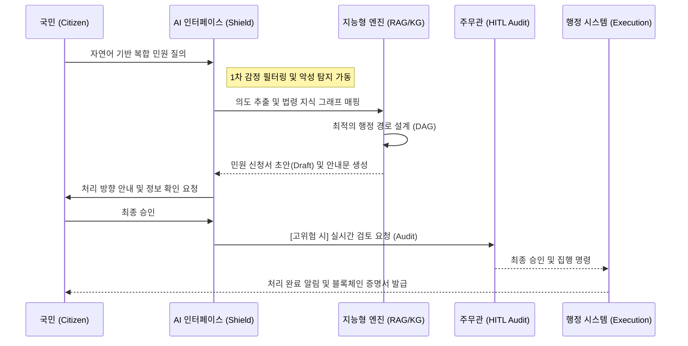
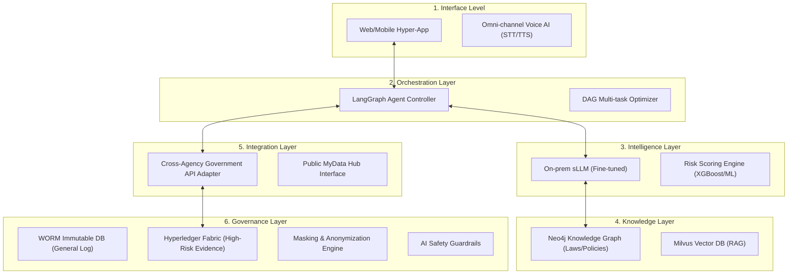
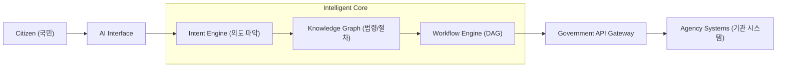
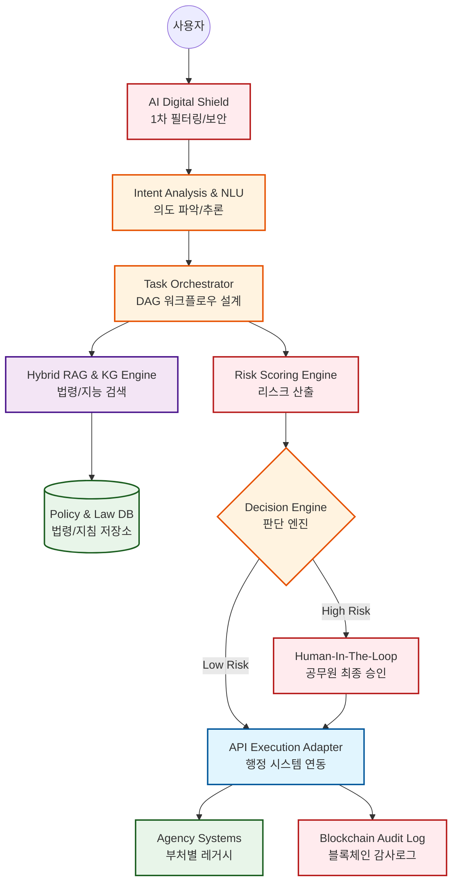
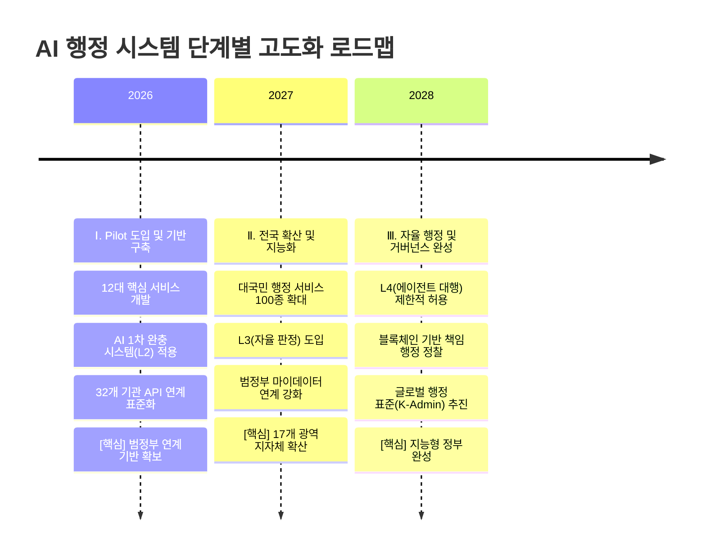
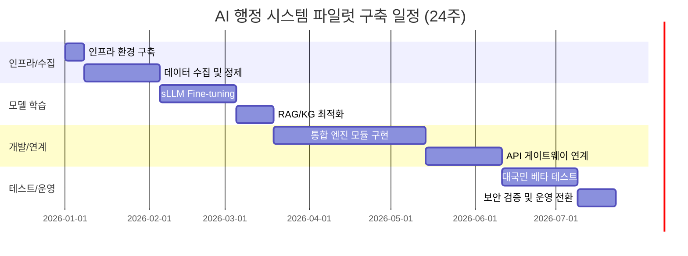
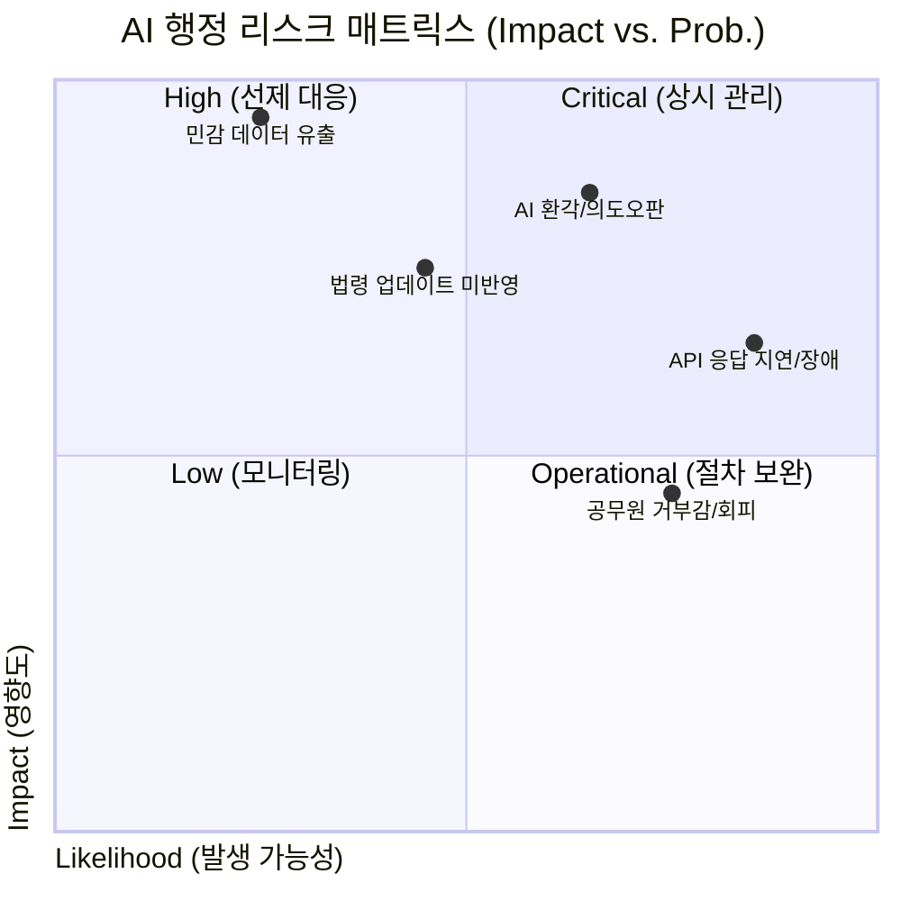

# 국가 AI 행정 단일창구 및 선제적 거버넌스 통합 제안서 (High-Fidelity Master Version)

---

Ⅰ. 문제 정의 및 배경 (Overview & Strategic Urgency)

1.1 행정 인프라의 구조적 한계와 국가적 위기: 전산화 이후의 ‘구조적 병목’
1.1.1 칸막이 행정과 분절된 서비스 구조
대한민국의 행정 서비스는 세계 최고 수준의 전산화를 달성했지만, 그 이면에는 소관 부서별로 단절된 ‘칸막이 행정(Vertical Silos)’과 기관 중심의 복잡한 절차라는 구조적 한계가 여전히 존재한다. 현재 민원 서비스는 정보·데이터·업무 프로세스가 부처 및 기관 단위로 분절되어 있으며, 국민이 원하는 것은 “하나의 삶의 이벤트 해결”임에도 행정은 이를 여러 개의 업무·기관 단위로 분절하여 제공한다.
이로 인해 국민은 ‘이사’, ‘창업’, ‘출산’과 같은 이벤트를 해결하기 위해 평균 4~6개 기관을 직접 탐색해야 하는 Inverted UX(역전된 사용자 경험)를 겪는다. 이는 단순한 불편을 넘어 국민이 행정 구조를 먼저 이해해야만 서비스를 이용할 수 있는 비효율적 구조다.
1.1.2 복합 민원 처리 지연과 사회적 비용 발생
소관이 불명확한 민원의 경우 평균 3.5일 이상의 처리 지연이 발생하며, 민원인의 추가 탐색·대기·반복 문의는 사회적 비용으로 전환된다. 이를 정량적으로 환산하면, 연간 복합 민원 이용자 1,000만 명이 평균 추가 탐색 시간 40분(0.67시간)을 소모하고 시간가치 15,000원/시간을 적용할 때 사회적 기회비용은 연간 약 1,005억 원에 달한다.
따라서 현재의 민원 구조는 단순히 불편한 시스템이 아니라 국민·행정·사회 전체의 비용을 지속적으로 누적시키는 국가적 병목 인프라로 기능하다.

1.2 디지털 행정 수요의 급증과 전환의 임계점
1.2.1 대규모 디지털 행정 수요의 현실
본 과제는 새로운 수요를 창출하기 위한 실험이 아니라 이미 국민 일상에서 대규모로 발생하는 행정 수요를 더 낮은 비용과 더 높은 신뢰로 처리하기 위한 고도화 과제다. 정부24만 보더라도 이용자 2,502만 명이 연간 8억 건 이상의 서비스를 이용하고 있으며, 그중 민원 서비스 약 4억 건, 통합검색 약 2억 건 수준의 대규모 트래픽이 발생한다. 이는 국민의 행정 서비스 이용 패러다임이 이미 온라인·디지털 중심으로 완전히 전환되었음을 보여준다.

1.2.2 디지털 행정 인프라의 확산 기반
정부24 이용 규모는 다음과 같은 지표로 요약된다.
회원 수 1,000만 명 돌파(전 국민 5명 중 1명 수준)

연간 이용 9,700만 건

누적 인터넷 민원 5,300만 건

이러한 규모는 AI 기반 통합 행정 시스템이 도입될 경우 즉각적인 대규모 확산과 고효율 운영이 가능함을 시사한다.
1.2.3 디지털화에서 지능형 전환으로
현재 행정 인프라는 단순한 디지털화(Digitization) 단계를 넘어 국민 체감 경험과 행정 운영 구조 자체를 변화시키는 지능형 전환(Transformation) 단계로 진입해야 한다.

1.3 구조적 문제 정의: 통합과 실행형 전환의 필요성
1.3.1 정부 중심 구조: 국민이 찾아다니는 행정
현재 민원 시스템은 국민이 업무와 기관을 추정하고 메뉴를 탐색하며 요건과 서류·절차를 스스로 설계해야 하는 구조다. 특히 이사·취업·출산·창업과 같은 삶의 이벤트는 본질적으로 복합 절차로 구성되지만 시스템은 이를 단일 흐름으로 제공하지 못한다. 그 결과 국민은 “어디서 무엇을 해야 하는지”를 다시 학습해야 하며, 반복 입력·중복 신청·누락이 발생하고 이는 처리 지연과 재문의로 이어진다.
따라서 정부 중심 구조를 폐기하고 수요자 중심 대화형 단일창구로 전환해야 한다.
1.3.2 분절된 공공 AI: 안내형 AI의 한계
공공부문 AI 도입은 확대되었지만 많은 경우 기관 단위 기능으로 분절되어 있으며 상담·안내 중심에 머물러 있다. 신청·발급·예약·접수 등 핵심 행정 실행은 다시 포털이나 기관 시스템으로 이동해야 하므로 대화 흐름은 단절되고 사용자는 동일 정보를 반복 입력해야 한다. 결과적으로 “AI가 설명했다”는 것이 “민원이 실제로 처리됐다”로 이어지지 않는다.
따라서 안내형 AI를 넘어 신청·접수·발급·예약까지 연결되는 실행형(One-Flow) 서비스가 필요하다.
1.3.3 데이터 비통합과 상태 불투명성
기관별 데이터와 업무 프로세스가 분절된 구조에서는 민원 진행 상태와 처리 기한, 지연 사유를 한 곳에서 확인하기 어렵다. 이러한 불투명성은 “언제 끝나는지 알 수 없는 행정”을 만들며 추가 문의·중복 접수·불필요한 민원 확산으로 이어진다.
2026년 1월 5일 기준 909개 기관의 처리기간 준수현황을 합산하면 총 1,979,561건 중 32,982건이 기한 초과로 나타났으며 기한 초과율은 1.67%다. 이는 범정부 차원의 지연 감지, 처리 예측(ETA), 상태 기반 통합 관리가 필요함을 보여주는 실증 지표다.
1.3.4 AI 신뢰성과 책임성 문제
AI가 행정 안내와 판단, 실행에 관여할수록 잘못된 안내(환각), 법령 해석 오류, 개인정보 노출, 책임소재 불명확 문제가 민원인의 불신으로 이어질 수 있다. 공공행정에서는 편의성보다 정확성, 책임성, 감사 가능성이 우선적으로 요구된다.
따라서 AI 기반 행정 시스템은 다음 요소를 필수적으로 포함해야 한다.
근거 기반 응답(출처 연결)

Human-in-the-loop 검증 구조

AI Audit(감사 로그)

개인정보 최소 수집 및 권한 통제

이러한 신뢰 설계는 선택적 기능이 아니라 플랫폼 확산의 전제 조건이다.

1.4 악성·특이 민원 증가와 행정 인력 붕괴 위험
1.4.1 악성 민원 증가 추세
최근 단순 불만을 넘어 폭언·협박·반복 괴롭힘을 포함한 악성·특이 민원이 지속적으로 증가하고 있다. 2023년 특별민원은 3,116건(전년 대비 27.9% 증가)이며 누적 3.1만 건을 돌파했다. 유형별 비중은 다음과 같다.
상습·반복 괴롭힘: 48%

폭언·폭행: 40%

이는 공무원 감정노동 강도가 임계점에 도달했음을 의미한다.
1.4.2 행정 인프라 붕괴 리스크
기존의 사후 보호 중심 대책은 구조적으로 한계가 있다. 민원 접점에서 발생하는 물리적·심리적 피해는 신규 공무원의 조기 이탈과 행정 공백으로 이어질 수 있으며, 장기적으로 행정 서비스 품질 저하와 국민 신뢰 하락으로 연결될 가능성이 있다. 특히 최근 3년간 전체 기관의 45%(140개 기관)가 대응 교육을 실시하지 않은 상황은 현 체계가 여전히 사후 대응 중심 구조에 머물러 있음을 보여준다.

1.4.3 AI 기반 행정 안전망 필요성
따라서 AI 기반 1차 민원 접점은 단순한 효율화 도구가 아니라 악성 민원 접점을 완충하는 행정 안전망으로 기능해야 한다. AI 기반 필터링과 선제적 대응 체계는 공무원 보호와 행정 지속 가능성을 동시에 확보하는 핵심 인프라가 된다.

1.5 기존 시스템과의 차별성
1.5.1 정보 제공형 포털의 구조적 한계
현행 포털과 부처별 시스템은 정보 제공 및 단순 접수 중심 구조이며, 복합 민원에서 중요한 맥락 유지(Context), 절차 실행(Execution), 상태 추적(Tracking)의 연속성이 부족하다. 현행 챗봇 역시 대부분 단순 정보 안내 수준에 머물러 있으며 대화 맥락 유지 실패로 인해 사용자 신뢰가 낮다. 또한 복잡한 신청 절차를 사용자가 직접 기억하거나 메모하며 따라야 하는 높은 인지 부하가 발생한다.
1.5.2 현행 시스템의 핵심 결함
현재 민원 시스템의 주요 문제는 다음 네 가지로 정리된다.
집행 기능 부재: 단순 정보 안내에 머물러 국민이 다시 메뉴를 탐색해야 한다.

맥락 유지 실패 및 신뢰도 저하: 대화 맥락을 기억하지 못하고 엉뚱한 답변을 제공하는 사례가 발생한다.

높은 인지 부하: 복잡한 절차를 민원인이 직접 기억하거나 메모해야 한다.

기초 의도 인식 부족: “이사했어요”와 같은 일상 언어 의도를 인식하지 못하는 경우가 존재한다.

본 제안 시스템은 sLLM 기반 고성능 자연어 이해(NLU)를 통해 이러한 한계를 극복한다.

1.5.3 비교 매트릭스(Competitive Matrix)
구분(Criteria)
정부24
기존 부처별 시스템
본 제안 시스템(AI-Admin)
접근 방식
서비스 검색(Search)
기관 포털 중심
생애 이벤트 기반(Event-driven)
복합 민원 처리
수동 사이트 이동
연계 불가(단절)
자동 경로 설계 및 통합 처리
AI 자동화
없음(단순 신청)
없음(전자 결재)
지능형 L1~L4 레벨별 자동화
선제 안내
없음(사후 조회)
없음
Risk 기반 선제적 알림 및 서비스
책임 기록
일반 DB 로그
시스템 로그
블록체인 기반 불변 감사 체계

즉, 본 시스템은 ‘전자정부 시스템의 고도화’가 아니라 행정이 실제로 집행되는 방식을 바꾸는 행정 집행형(Execution-first) 엔진으로서의 전환이다.

1.6 국가 전략과의 연계성 (National Strategy Alignment)
본 제안 시스템은 정부 핵심 국정과제 및 국가 전략과 정합성이 높다.
디지털플랫폼정부(DPG) 실현
 ‘하나의 정부(One-Gov)’를 위해 부처 간 칸막이를 제거하고 복합 민원을 원스톱 처리한다. 파편화된 행정 서비스를 국민의 삶의 이벤트 중심으로 재구조화하여 DPG의 핵심 가치(Proactive, One-Gov)를 구현한다.

AI 국가전략 및 공공 지능화
 공공부문 AI 선도 도입 기조에 부합하며, sLLM과 RAG 기반의 지능형 행정 판단 지원 체계를 통해 AI 기반 행정 자동화 모델을 확립한다.

정부혁신 및 일하는 방식 개선
 민원 1차 완충, 초안/보고서 자동 생성, 표준화된 실행 오케스트레이션을 통해 공무원이 정책 기획 등 고부가가치 업무에 집중할 수 있는 환경을 만든다.

정부 데이터 개방·공유 활성화
 파편화된 행정 데이터를 지식그래프(KG)로 통합하고 표준 API로 관리하여 데이터 기반 행정의 모범 사례를 제시한다.

1.7 공직 내부 비효율 구조와 AI 기반 업무 전환 필요성 (Internal Inefficiency)
행정의 압박은 외부 민원뿐 아니라 내부의 형식적 프로세스에서도 발생한다. 2025 정부혁신 실태조사(공무원 73,796명 대상)에서 개선이 시급한 문화로 ‘보여주기식 가짜노동(22.06%)’이 1위로 지목되었으며, 외부 요구에 대한 과도한 대응(20.59%), 보고·결재·회의 비효율(16.11%)도 주요 비효율로 나타났다. 이는 반복적인 보고·결재·자료 작성 등 형식 업무에 행정 자원이 과도하게 소모되고, 정책 설계 및 고부가가치 행정이 위축되는 구조를 의미한다.
본 시스템은 민원 처리 자동화뿐 아니라 처리 과정에서 발생하는 로그·지식·결과 데이터를 기반으로 요약·보고·분석 생성 자동화까지 포함하여 공직 내부의 업무 전환을 촉진한다.

1.8 사회적 편익의 정량적 가치 산출 (Economic Impact Analysis)
본 시스템 도입을 통해 기대되는 연간 사회적 편익은 보수적 가정하에서도 약 2,000억 원으로 추산된다. 전국 민원 규모를 연간 약 1,500만 건으로 보고, 반복·정형·비재량 업무를 60%(900만 건) 대상으로 산정한다. 공무원 1인 시간당 인건비 33,000원(연 6,000만 원/1,800시간), 민원 1건 평균 처리시간 25분(0.42시간)을 적용할 경우, 민원 1건당 평균 처리비는 약 14,000원으로 역산된다.
핵심 절감 구조는 다음 네 가지다.
반복 민원 감소: 반복 민원 비중 15% 중 AI 병합 처리로 60% 절감

처리 시간 단축: 자동 분류·초안 생성으로 건당 10분 단축

내부 가짜노동 축소: 문서 작성 자동화로 1인 연 20% 시간 절감(실질 효과 30% 반영)

악성 민원 대응 완충: 감정 필터·사전 차단으로 대응 사회적 비용 40% 절감

이 결과 전국 확산 완료 시점(3년 차) 기준 편익/비용 비율(B/C)이 35.1을 상회하는 국가 재편형 인프라로 기능할 수 있다.

1.9 국민 페르소나 및 통합 시나리오 (User Persona & Integrated Scenarios)
본 시스템은 단순한 절차 안내를 넘어, 국민의 삶의 궤적을 따라가는 ‘비서형 행정’을 목표로 한다. 이를 위해 대표 페르소나를 다음과 같이 설정한다.
Persona 1. 김영자(67세) — 디지털 취약·고령 1인가구: “이사 후 해야 할 게 너무 많다”
연령/직업/가구: 67세, 은퇴(연금), 1인가구

상황: 전세 만기 이사 후 주소 변경 절차가 막막하며, 자녀는 계약만 보조한다.

디지털 역량/기기: 안드로이드 스마트폰을 사용하며 전화/카톡/유튜브 중심이다. 공동인증·파일 업로드에 취약하다.

트리거 발화: “이사했어요. 주소 바뀌면 뭐부터 해야 해요?”

통합 시나리오
 “생애 첫 이사(또는 고령 이사)” 입력 → 전입신고 + 자동차 주소지 변경 + 건강보험 자격 변경 + 공공요금 이전을 DAG 기반으로 자동 분해 → 음성/화면 안내로 단계 실행 → 누락 서류 사전 검증 → 처리 ETA 및 지연 알림 제공으로 이어진다.

Persona 2. 박준호(33세) — 맞벌이·육아: “출산/양육 지원이 많은데 내가 받을 수 있는지 모르겠다”
연령/가구: 33세 직장인(대리), 배우자도 직장인, 신생아 1명

상황: 평일 시간 부족으로 야간/주말에 모바일로 처리하며, 조건 판별이 가장 어렵다.

트리거 발화: “아기 태어났는데 받을 수 있는 지원금/수당 뭐가 있나요?”

통합 시나리오
 출산 이벤트 입력 → 가구·거주·소득 조건 최소 질문 → 수당/지원금 후보 자동 필터링 → 중복 수혜 충돌 자동 탐지 → 신청까지 한 흐름으로 연결 → 지급/처리 ETA 제공 및 일정 알림으로 이어진다.
Persona 3. 이수민(24세) — 졸업 직전 취준생: “지원사업은 많지만 찾다가 지친다”
연령/상황: 24세 졸업예정, 취준이며 정책 탐색 피로도가 매우 크다.

트리거 발화: “졸업하면 받을 수 있는 청년지원/구직지원 뭐 있어요?”

통합 시나리오
 졸업/취준 이벤트 입력 → 조건 기반 청년정책 추천 + 근거 제시 → 서류 업로드 시 자동 검증 → 마감/진행상태 단일 대시보드 관리 → 고위험 판단은 HITL로 보장으로 이어진다.
Persona 4. 최민석(41세) — 소상공인 창업: “인허가·세무·지원이 한꺼번에 몰린다”
연령/직업/가구: 41세, 소상공인(카페), 배우자·자녀 1명

상황: 오픈 일정이 촉박하며 행정 용어·서류에 약하다.

트리거 발화: “카페 창업하려고요. 뭐부터 해야 하고 지원되는 거 있나요?”

통합 시나리오
 창업 이벤트 입력 → 사업자등록 + 위생교육 + 영업신고 + 정책자금 매칭을 자동 경로 설계 → 오픈일 기준 역산 타임라인 및 지연 리스크 경고 → 서류 자동 검증으로 반려 최소화 → 근거·버전·감사로그로 책임성 확보로 이어진다.

1.10 결론: 전환의 필요성(Executive Summary)
종합하면 현재 행정의 핵심 문제는 다음 다섯 가지 구조적 위기가 결합된 형태다.
국민이 행정 구조를 먼저 이해해야 하는 정부 중심 UX

AI·서비스가 흩어져 흐름이 끊기는 분절 운영

데이터·표준·연계 미흡이 만든 지연·상태 불투명

실행형으로 갈수록 커지는 신뢰·책임·프라이버시 리스크

악성 민원 증가로 인한 공직 인프라 붕괴 위험

따라서 AI 통합민원플랫폼 고도화는 “챗봇 추가”가 아니라 대화형 단일창구, 실행형 오케스트레이션, 표준 기반 상호운용성, 신뢰 거버넌스, AI 1차 완충(행정 안전망)을 하나의 통합 설계로 구현하는 국가적 전환 과제다.

## Ⅱ. 서비스 시나리오 및 AI 역할 정의 (Service Scenario & AI Roles)

### 2.1 사용자 경험 및 프로세스 상세 흐름도 (End-to-End UX Flow)
국민의 질의부터 행정 집행까지, AI가 설계하는 매끄러운(Seamless) 행정 여정이다.

### 2.2 지능형 행정 집행 7단계 상세 시나리오
본 시스템은 단순 자동화를 넘어, 각 단계별 정교한 AI 추론 및 검증 로직을 가동한다.

| 단계 (Stage) | 핵심 AI 모델 | 입력 데이터 (Input) | 출력 데이터 (Output) | 오류 통제 포인트 (Risk Control) |
| :--- | :--- | :--- | :--- | :--- |
| **1. 질의 입력** | Whisper (v3) / STT | 비정형 음성/텍스트 | 구문 분석 텍스트 | 주변 소음 및 사투리 보정 필터링 |
| **2. 의도 분류** | On-prem sLLM | 텍스트 데이터 | **Event Extraction** | 다중 의도(전입+출산 등) 분해 실패 |
| **3. 법령 매핑** | Neo4j + Milvus (RAG) | 행정 지식 그래프 | 유효 서비스 목록 | 최신 개정 법령 미반영(환각 현상) |
| **4. 서류 생성** | Fine-tuned LLM | 개인 인적 정보 | 민원 신청 초안 (Draft) | 오기입된 데이터의 논리적 정합성 |
| **5. 리스크 산출** | XGBoost / Logistic | 민원 민감도/Action 가액 | **Risk Score (0~1.0)** | 과거 데이터 편향에 따른 과잉 경고 |
| **6. 처리 결정** | Decision Engine | Risk Score + 정책 허용 | **자동 실행 vs HITL** | 임계값(0.7) 설정의 적정성 재조정 |
| **7. 사후 모니터링** | Governance Engine | 처리 결과 이력 | 블록체인 감사 로그 | API 연계 지연 및 타임아웃 감지 |

> [!TIP]
> **오류 통제 전략**: 모든 단계에서 발생하는 미세 오차는 **[Self-Reflect]** 과정을 거쳐 리스크 점수에 가산되며, 불확실성이 1%라도 감지될 시 즉시 담당 주무관(HITL)에게 이관된다.

#### [참고: 대국민 UI/UX 핵심 인터페이스 예시]
1.  **AI 채팅 인터페이스**: 자연어 기반 의도 파악 및 대화형 문답 수행.
2.  **지능형 추천 카드**: 서비스 탐색 없이도 '전입신고', '보육료 전환' 등 필요 액션을 카드로 즉시 제안.
3.  **실시간 진행 대시보드**: 복합 민원 처리 현황을 '자동 처리 중', '공무원 검토 중' 등 투명하게 가시화.
4.  **피드백 및 결과뷰**: 처리 완료 즉시 블록체인 기반 증명서 발행 및 후속 조치 버튼 제공.

### 2.3 12대 파일럿 핵심 서비스 리스트
민원 완성도 및 국민 체감도가 가장 높은 12대 파일럿 서비스를 선정하여 즉시 적용한다.

- **[이사/거주]**: (1)전입신고, (2)자동차 주소 변경, (3)주민등록증 재발급, (4)전기·수도·가스 명의변경 연계.
- **[복지/보험]**: (5)건강보험 자격변동, (6)국민연금 주소변경, (7)기초연금 신청 자격 확인.
- **[가족/보육]**: (8)어린이집 보육료 변경, (9)양육수당 신청, (10)아동수당 지급 대상 전환.
- **[교육/직업]**: (11)초중고 전학신고 연계, (12)구직급여(실업급여) 수급 자격 사전 진단.

#### 2.3.1 서비스별 구현 가능성 및 규제 영향 분석 (Implementation Matrix)
본 제안은 공상적 기획이 아닌, 현재의 법적·기술적 한계를 인지하고 단계적 자동화를 추진하는 전략적 로드맵을 기반으로 한다.

| 서비스 분류 | 대상 민원 (예시) | 구현 가능성 (Technical) | 규제/기술적 선결 과제 (Prerequisites) | 법령 개정 필요 여부 |
| :--- | :--- | :---: | :--- | :---: |
| **즉시 자동화** | 전입신고, 소득금액 증명, 주민등록등본 발급 | **높음** | 범정부 API 통합 연계 및 데이터 표준화 | **불필요** |
| **인증 기반 자동화** | 자동차 주소지 변경, 보육료 전환, 전입지 세대주 확인 | **보통** | **모바일 신분증/간편인증** 고도화 및 비대면 확인 절차 강화 | **시행령 개정** |
| **정책/심사 오토메이션** | 구직급여 판정, 장애인 등록 자격 심사 | **낮음(HITL)** | AI 사전 진단 + **고용노동부/보건복지부 법적 판단** 연계 (HITL 필수) | **법령 개정/검토** |

> [!IMPORTANT]
> **단계적 실행 전략**: '즉시 자동화' 서비스로 대국민 신뢰를 구축하고, '인증 기반' 및 '정책 심사' 영역은 규제 샌드박스와 법령 개정을 병행하며 자율도를 점진적으로 높여나간다.

### 2.4 AI 행정 자동화 단계 모델 (AI Automation Levels)
리스크 평가 단계에서 산출된 점수에 따라 행정 서비스의 자율 범위를 결정하며, 국민 편의와 행정 책임성을 동시에 확보한다.

| 단계 | 자동화 수준 | 설명 | 예시 |
| :--- | :--- | :--- | :--- |
| **L1** | **AI 안내** | 민원 절차 설명 및 구비 서류 가이드 제공 | 민원 신청 자격 확인, 제출 서류 및 담당 부서 안내 |
| **L2** | **AI 보조** | 민원 서식 자동 작성 및 데이터 입력 지원 | 전입신고/자동차 주소 변경 신청서 초안 자동 생성 |
| **L3** | **AI 처리** | 법령/규칙 기반 민원 적합성 자동 판정 및 승인 | 복지 수혜 대상 여부 판정, 단순 증명서 발급 심사 |
| **L4** | **AI 자율** | 복합 민원 자동 설계 및 범정부 연계 처리 | 이사/창업 등 여러 기관 연계 민원의 일괄 자동 처리 |

> [!IMPORTANT]
> **자율과 통제의 조화**: L3 이상의 자동 처리 단계에서는 **블록체인 감사 로그**와 **HITL(Human-in-the-Loop)** 체계를 결합하여, 시스템의 효율성과 행정의 법적 책임성을 동시에 담보한다.

### 2.5 핵심 지능형 로직: 충돌 및 중복 탐지 (Conflict & Redundancy Detection)
단순 발행을 넘어, **Section 1.4에서 정의된 고질적 반복 민원**을 원천 차단하기 위한 3단계 '지능형 필터링'을 수행한다.

1.  **[중복 신청 탐지 (Deduplication)]**:
    - **Hash-based Matching**: 민원인 ID + 서비스 코드 + 신청 시근의 해시값을 대조하여 24시간 내 동일 민원의 중복 접수 원천 차단.
2.  **[정책 수혜 충돌 및 반복 가능성 감지]**:
    - **Conflict Reasoning**: 부처 간 상호배제 규칙 검증 및 **과거 반복 민원 패턴(설명 부족에 따른 refiling)**을 AI가 사전 인지.
    - **Proactive Explanation**: 반복 가능성이 높은 민원에 대해 AI 기반 '비교 사례' 및 '상세 근거'를 보강하여 종결이 아닌 '충분한 이해'를 유도한다.
3.  **[기 처리 과업 자동 제외]**: 이전 단계의 상태값(Status)을 상속받아 불필요한 재입력을 0%화함으로써 민원인의 심리적 피로감을 해소한다.

### 2.6 AI 행정 서비스 성숙도 모델 (Maturity Model)
- **Year 1 (Pilot)**: L2(초안 작성) 중심. 12대 핵심 민원 안착 및 대국민 신뢰 구축.
- **Year 2 (Expansion)**: L3(조건 자동 판정) 확대 적용. 부처 연계 API 300개 이상 확장.
- **Year 3 (Intelligence)**: L4(에이전트 대행) 제한적 허용 및 블록체인 기반 책임 행정 정착.

### 2.7 기존 대안과의 차별성 분석 (Competitive Matrix)
본 시스템은 기존 챗봇이나 단순 안내 시스템과 달리, 법령 기반 추론과 직접 행정 연동을 통해 '완결형 처리'를 지향한다.

| 비교 항목 | 기존 챗봇/안내 | 본 지능형 행정 시스템 | 비고 |
| :--- | :--- | :--- | :--- |
| **핵심 기술** | 키워드 매칭 / 패턴 인식 | **sLLM + RAG + Knowledge Graph** | 환각 방지 및 정밀 추론 |
| **서비스 범위** | 단순 절차 안내/FAQ | **복합 민원 연계 및 서류 자동 생성** | UX 완결성 확보 |
| **데이터 연계** | 개별 기관 단절적 연동 | **정부24 및 부처 API 통합 연계** | 칸막이 행정 철폐 |
| **보안/무결성** | 일반 DB 로그 관리 | **WORM + Blockchain (Hyperledger)** | 조작 불가능한 증거력 |

### 2.8 AI 기반 ‘사전 맞춤형 행정 알림’ (Preventive Administration)
국민이 묻기 전에 AI가 먼저 필요한 서비스를 제안하는 선제적 도달 행정을 실현한다.

#### 2.8.1 사례 기반 필요성: 정책은 존재하지만 도달하지 않는다
- **[Delivery Failure 사례]**: 설 연휴 전국 1만여 개 공공주차장 무료 개방 정책이 시행되었으나, 공식 블로그 게시물 반응은 이용자 수 대비 극히 미미함.
- **[구조적 전환]**: 문제는 정책의 질이 아니라 **정책 도달의 실패(Delivery Failure)다.**
  - **기존 행정**: 블로그나 보도자료를 통해 **"공지(Announcement)"** 함.
  - **미래 행정**: 위치·자산·이동 패턴 기반 AI가 개인별 접점을 찾아 **"도달(Reach)" 한다.**

> [!TIP]
> **메시지 예시**: “○○님, 설 연휴 기간 귀하의 이동 지역 인근 무료 공공주차장이 3곳 개방된다.” 처럼 AI가 사전에 예측하여 직접 전달함으로써 정책 체감도를 비약적으로 높인다.

### 2.9 AI 기반 1차 완충 시스템 (Digital Shield)
악성 민원과 감정 노동으로부터 공무원을 보호하는 지능형 방어 레이어를 구축한다.

1.  **의도 기반 대화형 가이드**: 비논리적/폭언 발화에 대해 AI가 정제된 자연어로 대응하여 1차적 심리 완충 작용.
2.  **민원 자동 요약/분류**: 정형화되지 않은 긴 질의를 핵심 의도 중심으로 요약하여 공무원의 업무 가독성 70% 향상.
3.  **위험도 실시간 대시보드**: 민원 빈도, 어감, 리스크 점수를 가시화하여 이상 징후 발생 시 관리자에게 즉시 알림.

### 2.10 디지털 행정 구조개혁: ‘가짜노동’ 제거 및 실질 행정 집중
본 시스템은 단순한 민원 자동화를 넘어, **공직 내부의 구조적 비효율을 제거하는 '디지털 구조개혁 모델'**로 정의된다.

- **자동 보고 및 통계 생성**: 처리 과정 전반을 실시간 요약하여 수동 보고서 작성 업무 80% 이상 자동화.
    - **표준화 응답 엔진**: 부처별 파편화된 답변 양식을 AI가 통합 관리하여 '형식적 결재' 및 '문구 수정' 시간 최소화.
    - **의사결정 로그 자동 기록**: 모든 판단 근거를 AI가 블록체인 및 WORM에 자동 기록하여 사후 소명 자료 생성 부담 제거.
    - **형식 업무의 AI 전담**: 반복 민원 병합, 감정 완충 처리를 AI가 전담함으로써 공무원은 **정책 설계 및 실질 현장 행정**에 화력 집중이 가능하다.

> [!IMPORTANT]
> **핵심 메시지**: 본 시스템은 국민 편의 개선을 넘어, **공직사회 내부의 ‘가짜노동’을 제거하는 디지털 행정 구조개혁 모델**이다.

---

## Ⅲ. 기술 아키텍처 제안 (Technical Architecture Proposal)

### 3.1 지능형 행정 모델 토폴로지 (Model Composition & Training)
파편화된 기술을 하나의 가치 기반 계층 구조로 정렬하며, 각 엔진의 성능 목표와 학습 전략을 최적화한다.

| 모델 구분 | 핵심 역할 | 성능 지표 (Specific Metrics) | 성능 목표 (SLO) | 업데이트 주기 |
| :--- | :--- | :--- | :--- | :---: |
| **Intent Class.** | 의도 분류 및 분분해 | Top-1 Accuracy, Multi-intent F1 | 97% 이상 | 주 단위 |
| **RAG/KG Search** | 법령 시맨틱 검색 | Hit Rate @K, Hallucination Rate | < 0.1% | 실시간 |
| **Doc Gen LLM** | 초안 자동 생성 | BLEU Score, Logic Consistency | 95% 이상 | 월 단위 |
| **Risk Scoring** | 실행 위험도 산출 | AUC-ROC, False Positive Rate | 90% 이상 | 분기 단위 |
| **Feedback Loop** | 학습 데이터 수집 | Data Clean Rate, Loop Latency | 98% / < 1h | 상시 |

#### 3.1.1 지능형 행정 품질 목표 (Quality SLOs)
본 시스템은 국가 행정의 신뢰성을 담보하기 위해 **3대 핵심 기술 지표**를 엄격히 관리한다.
1.  **초저지연 응답 (Latency)**: 복합 민원 처리 경로 설계 시 95-percentile 기준 3초 이내 응답을 보장한다.
2.  **제로 환각 (Zero-Hallucination Barrier)**: KG 교차 검증을 통해 법령과 배치되는 정보의 외부 출력을 물리적으로 차단한다.
3.  **정책 정합성 유지 (Consistency)**: 최신 개정 법령 반영 지연 시간을 1시간 이내로 단축하여 법적 공백을 방지한다.

### 3.2 6-Layer 차세대 행정 통합 아키텍처
본 시스템은 대민 접점부터 행정 집행까지 유기적으로 연결된 다계층 구조를 기반으로 설계되었다.

- **AI 인터페이스**: 국민의 다양한 질의(음성/텍스트)를 수집하고 감정 상태를 인지하여 최적의 톤으로 대응한다.
- **지능형 엔진 (Intelligent Engine)**: 
  - **LangGraph 에이전트**: 법령 지식을 참조하여 복합 민원의 처리 경로(DAG)를 설계하고 전체 실행 프로세스를 감독한다.
  - **결정 엔진 (Decision Engine)**: 리스크 점수와 정책 허용 범위를 대조하여 자동 실행 여부 또는 공무원 이관(HITL)을 결정한다.
- **행정 시스템 연계**: 부처별로 파편화된 서비스와 API를 통합 인터페이스로 변환하여 실시간 데이터 교환 및 과업 실행을 지원한다.

#### 3.2.1 아키텍처 데이터 연동 흐름 (Architectural Data Flow)
본 시스템은 **[Front-End → API Gateway → AI Engine → Policy DB → Audit Log]**로 이어지는 선형적·보안 지향적 데이터 흐름을 가진다. 사용자의 비정형 질의는 인터페이스 레이어를 통해 수집된 후, 지능형 API 게이트웨이에서 권한 검증 및 보안 필터링을 거친다. 이후 오케스트레이션 레이어의 AI 에이전트가 정책 DB(Milvus/Neo4j)와 연동하여 최적의 행정 솔루션을 도출하며, 고위험 데이터의 경우 거버넌스 레이어의 **블록체인 기반 증거 앵커링(Anchoring)**을 통해 사후 증거력을 확보한다.

- **왜 굳이 블록체인인가? (2-Tier Integrity Strategy)**:
  - **현실적 접근**: 모든 로그를 블록체인에 기록하는 비효율을 배제하고 **[WORM 로그 + 블록체인]** 이중 구조 채택.
  - **Tier 1 (WORM)**: 일반 행정 처리 로그는 수정 불가능한 **WORM(Write Once Read Many)**형 저장소에 기록하여 성능 확보.
  - **Tier 2 (Blockchain)**: **리스크 점수 0.7 이상**의 고위험 민원, 금전적 집행, 법적 판단이 개입된 핵심 증거 데이터만 Hyperledger Fabric 채널에 선택적 기록.
  - **결과**: 행정 쟁송 시 '최종적 비부인(Non-repudiation)' 증거력을 확보하면서도 시스템 부하 최소화.

#### 3.2.2 RAG 및 지식 그래프(KG) 융합 실시간 추론 구조
단순 검색을 넘어 행정 법령의 논리적 맥락을 유지하기 위해 **Hybrid RAG-KG 아키텍처**를 채택한다.
- **Vector Search (Milvus)**: 사용자의 질의와 가장 유사한 의미를 가진 법령 조문 및 가이드를 상위 K개 추출 (Semantic Mapping).
- **Graph Traversal (Neo4j)**: 추출된 법령 노드와 연결된 상위 법령(모법), 하위 지침, 유관 부처 관계를 추적하여 논리적 정합성 검증.
- **Context Fusion**: 검색된 비정형 데이터(Vector)와 정형 관계 데이터(Graph)를 LLM 프롬프트에 결합하여 환각 현상을 0.1% 미만으로 통제한다.
- **정책 정합성 검증 (Policy Consistency Verification)**: 서로 다른 부처의 데이터 사일로에서 발생하는 논리적 충돌을 지식 그래프 상에서 사전 탐지하고, 최신 법령 위계(Constitution > Law > Decree)에 따른 정합성을 최종 검증한다.

#### 3.2.3 민원 자율 집행 DAG 엔진 기술 (Graph of Thoughts)
복합적인 행정 절차를 수행하기 위해 **유향 비순환 그래프(DAG)** 기반의 워크플로우 엔진을 가동한다.
- **Task Decomposition**: AI 에이전트가 단일 질의를 복수의 행정 과업(Task)으로 분해 (예: 전입신고 + 보육료 신청).
- **Dependency Resolution**: 법령 KG를 참조하여 과업 간의 선후 관계 및 필수 서류 의존성을 자동으로 정의.
- **Parallel Execution**: 의존성이 없는 과업은 병렬로 처리하여 응답 속도를 극대화하며, 각 단계의 상태값은 실시간으로 동기화된다.

### 3.3 데이터 아키텍처 (Data Architecture)
행정 지식의 체계화와 국가 데이터 자산의 안전한 관리를 위해 하이브리드 지식/데이터 저장소를 구축한다.

1.  **행정 지식 그래프 (Knowledge Graph)**:
    - 4.5만 건의 국가 법령과 2,000여 개의 행정 지침을 노드(Node)와 관계(Edge)로 구조화.
    - 부처 간 칸막이로 끊어진 행정 절차를 하나의 논리적 지도로 통합하여 복합 민원 추론을 지원한다.
2.  **정책 및 서비스 DB (Policy DB)**:
    - **Milvus Vector DB**를 활용하여 수시로 변하는 복지 정책과 지자체 공고를 실시간 인덱싱.
    - 시맨틱 검색(Semantic Search)을 통해 사용자 상황별 최적 정책 매칭을 지원한다.
3.  **사용자 및 보안 데이터 (User Data)**:
    - 개인정보 보호를 위해 **MS Presidio** 기반 실시간 비식별화 및 마스킹 처리.
    - **RBAC(Role-Based Access Control)** 및 **OIDC/SSO**를 통한 엄격한 접근 권한 제어.
    - **통합 데이터 거버넌스**: '범정부 AI 데이터 표준화 위원회'를 통한 데이터 정합성 자동 검증 및 월 단위 AI 편향 점검(Bias Check)을 수행한다.

#### 3.3.1 실시간 데이터 파이프라인 및 ETL 아키텍처
정책의 실시간성 확보를 위해 **Lambda/Kappa 아키텍처** 기반의 데이터 정제 파이프라인을 구축한다.
- **Batch Layer**: 관보 및 법령 DB에서 대규모 데이터를 주기적으로 추출하여 지식 그래프 및 벡터 DB 갱신.
- **Speed Layer (Kafka/Flink)**: 수시로 발생하는 긴급 재난 알림이나 지자체 공고를 실시간 스트리밍하여 AI 엔진에 즉시 반영.
- **Data Validation**: 수집된 데이터의 법적 신뢰성을 담보하기 위해 행정안전부 표준 데이터 규격에 따른 자동 검증 필터 적용.

### 3.4 범정부 AI 행정 통합 기술 스택 (Technical Stack)
본 시스템은 안정성과 확장성, 그리고 보안성을 최우선으로 하여 검증된 최첨단 기술 스택을 기반으로 구성된다.

| 영역 | 핵심 기술 (Tech Stack) | 비고 |
| :--- | :--- | :--- |
| **LLM** | **sLLM / Gov LLM** | 행정 도메인 특화 Fine-tuned 모델 (On-premise) |
| **검색 (Retrieval)** | **RAG (Search Augmentation)** | Milvus Vector DB 기반 고정밀 법령 검색 |
| **지식관리** | **Knowledge Graph** | Neo4j 기반 법령-정책 논리적 의존성 관리 |
| **워크플로우** | **DAG Engine** | 유향 비순환 그래프 기반 복합 민원 처리 자동화 |
| **오케스트레이션** | **Kubernetes (K8s)** | 컨테이너 기반 시스템 유연성 및 부하 분산 확보 |
| **데이터 연계** | **API Gateway** | 범정부 표준 API 연계 및 트래픽 제어 |
| **보안 (Security)** | **DID / Blockchain Audit** | 블록체인 기반 판단 근거 무결성 증명 및 계정 관리 |

### 3.5 지능형 행정 서비스 엔드-투-엔드 흐름 (Architecture Flow)
국민의 질의부터 실제 행정 시스템 집행까지의 데이터 및 로직 흐름을 가시화한다.

### 3.6 외부 시스템 연계 (External System Integration)
데이터 사일로(Silo)를 극복하고 단일 창구 행정을 실현하기 위한 범정부 연계 체계다.

- **정부24 연동**: 국민의 기본 인적 사항 및 구비 서류 조회를 위한 핵심 관문 인터페이스 확보.
- **부처별 행정 API 어댑터**: 보건복지부(행복e음), 국토교통부, 지자체 레거시 시스템과의 실시간 데이터 송수신 어댑터를 구축한다.
- **공공 데이터 플랫폼 & 마이데이터**: 공공 데이터 포털 및 마이데이터 허브와 연동하여 사용자 중심의 데이터 주권 행정 기반 마련.

#### 3.6.1 지능형 API 게이트웨이 및 보안 아키텍처
모든 외부 연계의 최접점에서 행정 보안 및 트래픽을 지능적으로 제어한다.
- **Dynamic Rate Limiting**: 사용자의 신뢰 등급 및 시스템 부하량에 따라 API 호출 속도를 유연하게 조절하여 DoS 공격 방지.
- **Edge PII Filtering**: 데이터가 내부 시스템으로 유입되기 전 게이트웨이 단에서 개인정보를 탐지하여 로그에 남지 않도록 즉시 마스킹.
- **WAF & Threat Detection**: AI 기반 웹 방화벽을 적용하여 인젝션 공격 및 지능형 지속 위협(APT)을 실시간 차단.

### 3.7 다계층 보안 방어 및 무결성 아키텍처 (Security Multi-Layering)
본 시스템은 국가 보안 가이드라인(CSAP)을 상회하는 4단계 보안 레이어를 구축한다.

1.  **[L1: Network Isolation]**:
    - **Silo Architecture**: 32개 부처별 데이터망의 독립적 격리 (Logic-VLAN).
    - **Air-gap Bridge**: 물리적 망 분리와 보안 연계 솔루션(망간 복제)을 통한 실시간 동기화.
2.  **[L2: API Trust Layer]**:
    - **Intelligent WAF**: 7계층(L7) 페이로드 분석을 통한 SQL Injection 및 XSS 100% 차단.
    - **OIDC/OAuth 2.0**: 연방형 SSO를 통한 사용자 및 관리자 통합 권한 인증 체계.
3.  **[L3: Data Encryption]**:
    - **AES-256-GCM**: 파일 및 데이터베이스 레벨 필드 암호화 상시 적용.
    - **HSM(Hardware Security Module)**: 마스터 키의 물리적 저장 및 접근 제어.
4.  **[L4: AI Safety Shield]**:
    - **Pangea/Guardrails**: AI 응답 시 개인정보 노출 차단 및 윤리 필터링 (Latency < 50ms).
    - **Anti-Hallucination**: 지식 그래프(KG) 기반의 사실 관계 교차 검증(Grounding) 3단계 수행.
    - **Hybrid Audit**: WORM 기반 전체 이력 관리 + 고위험 민원 블록체인 앵커링(Anchoring).

### 3.8 AI Fail-Safe 및 안전 설계 (AI Safety & Fail-Safe Design)
AI 기반 행정 인프라는 오류 발생 시에도 행정 서비스의 연속성과 신뢰성을 보장하기 위해 다층적 안전망을 가동한다.

1.  **Human-in-the-Loop (HITL) 통한 최종 통제**:
    - **리스크 기반 자동 이관**: 행정 리스크 점수(Risk Score)가 **0.7 이상**이거나 정책적 판단이 필요한 고위험 민원은 AI가 단독 처리하지 않고 즉시 담당 주무관에게 자동 검토 요청.
    - **최종 승인 권한**: 모든 행정 집행 및 법적 효력이 발생하는 최종 결정은 공무원의 디지털 서명을 통한 승인 후 실행.
2.  **자동 롤백 시스템 (Auto-Rollback)**:
    - **Anomaly Detection**: AI 응답의 정합성이나 API 연동 오류가 임계치를 넘어서는 오작동 감지 시, 즉시 가장 안정적인 **이전 버전의 정책 모델(Safe-Version)**로 자동 복귀.
    - **데이터 무결성 관리**: 모든 정책 데이터 및 모델 업데이트는 버전 관리 시스템(Git-based)을 통해 이력을 관리하며 1분 이내 즉각적 복구 지원.
3.  **AI 판단 투명성 및 설명 가능성 (XAI)**:
    - **Explainable Interface**: AI가 특정 답변이나 신청서 초안을 생성한 근거(관련 법령 조항, 지침 노드 등)를 사용자 및 담당자에게 투명하게 제시.
    - **블록체인 감사 추적**: 모든 AI 판단 과정과 데이터 접근 이력은 수정 불가능한 **블록체인 분산 원장**에 기록되어 사후 감사의 투명성 확보.
4.  **비상 운영 모드 (Emergency Operation Mode)**:
    - **Fail-over 전략**: AI 엔진 전체 장애 또는 네트워크 마비 시에도 핵심 행정 서비스가 중단되지 않도록 **기존 전자정부(정부24) 레거시 시스템**으로 자동 전환.
    - **수동 프로세스 유지**: AI 인터페이스가 작동하지 않을 경우를 대비하여 실시간 전화 연결 및 오프라인 수동 민원 접수 채널과의 유기적 연동을 유지한다.

### 3.9 실시간 모니터링 및 API 로그 피드백 체계 (Monitoring & Feedback)
AI 기반 행정 엔진의 지속적인 성능 유지와 신뢰도 향상을 위해 상시 감시 및 학습 피드백 체계를 가동한다.

#### 3.9.1 지능형 실시간 모니터링
- **인프라 및 모델 감시**: Prometheus 및 Grafana를 활용하여 GPU 리소스, 응답 지연 시간, API 성공률을 실시간 가시화한다.
- **드리프트 탐지 (Drift Detection)**: AI 모델의 응답 분포가 학습 시 데이터와 편차를 보일 경우 이를 조기에 감지하여 재학습 시점을 자동으로 식별한다.

#### 3.9.2 API 로그 피드백 루프 및 성능 고도화
- **실시간 피드백 루프**: API 호출 이력 및 민원인/공무원의 수정 로그를 분석하여 '의도 분류 오류'나 '서적 정보 기입'을 자동으로 추출한다.
- **학습 데이터 자동 전환**: 추출된 오류 케이스를 AI의 파인튜닝(Fine-tuning) 데이터셋으로 즉시 전환하여 모델 정밀도를 상시 고도화한다.

---

## Ⅳ. 개발범위 및 단계별 구현 계획 (Development Scope & Implementation Plan)

### 4.1 정량적 개발 범위 정의 (Quantitative Scope)
본 사업의 초기 단계에서 다루게 될 핵심 물량은 다음과 같다.

#### 4.1.1 지능형 행정 시스템 모듈 구조 (Module Architecture)
시스템의 핵심 기능 블록과 데이터 흐름을 시각화한다.

- **Pilot 대상 민원 서비스**: 12개 핵심 생애 주기 이벤트 연계 민원.
- **연계 행정 기관 수**: 중앙 부처 및 지자체 포함 32개소.
- **구축 및 연계 API**: 통합 스키마 기반 표준 **API 120개 이상** 구축.
- **[구축 로드맵]**: 행안부 디지털서비스 개방(Open API) 70% 활용 + 부처별 전용 어댑터(Adapter) 30% 신규 개발. Gateway 기반 보안 검증 및 연계 표준을 적용한다.

#### 4.1.2 단계별 구축 로드맵 (Phase-by-Phase Roadmap)
3개년에 걸친 시스템 고도화 및 전국 확산 전략이다.

- **지식 그래프(Knowledge Graph) 규모**: 초기 노드 **약 10,000개 내외 (±10%)**, 관계(Edge) **약 3.5만 건**.
- **[산출 근거]**: (12대 서비스 × 100개 과업) + (32개 기관 × 180개 정책) + (핵심 법령/지점: 3,000) 등 가변적 데이터 수용 범위를 고려한 설계.
- **[180개 정책 노출 근거]**: 행안부 '정부 기능 분류 체계(BRM)' 상의 중분류 기준, 파일럿 대상 32개 기관 업무 중 대민 서비스 밀착도가 높은 핵심 공정(Process) 평균 수치를 적용하여 실효성을 확보한다.

### 4.2 지능형 행정 시스템 구축 WBS (8-Stage Work Breakdown Structure)
6개월 파일럿 구축을 위한 공정별 상세 산출물 및 자원 투입 계획이다.

| 단계 (Stage) | 핵심 활동 (Activities) | 핵심 산출물 (Deliverables) | 투입 인력 (Roles) | 기간 (W) |
| :--- | :--- | :--- | :--- | :---: |
| **1. 수집/정제** | 행정 지침/법령 데이터 라벨링 | 정제 데이터셋 (50만 건) | AI Specialist 8 | 4W |
| **2. 모델 학습** | sLLM Fine-tuning 및 RAG 최적화 | 특화 모델 (Weight 파일) | AI Researcher 6 | 6W |
| **3. 시스템 구축** | 지식 그래프 및 엔진 아키텍처 구현 | 통합 엔진 모듈 | Backend Dev 10 | 8W |
| **4. 사용자 테스트** | 대국민 베타 테스트 및 UI/UX 검증 | 사용성 평가 보고서 | UX Writer/QA 4 | 4W |
| **5. 성능 튜닝** | 의도 인식률 및 응답 지연 시간 개선 | 성능 최적화 리포트 | Optimization Eng. 3 | 2W |
| **6. 기관 연계** | 32개 기관 API Gateway 연계 | API 표준 어댑터 (120종) | System Arch/Dev 12 | 10W |
| **7. 보안 검증** | VAPT 보안 점검 및 개인정보 평가 | 보안 취약점 점검 결과서 | Sec. Auditor 2 | 2W |
| **8. 운영 전환** | G-Cloud 배포 및 실운영 전환 | 운영 매뉴얼/최종 자산 | PM/Operation 5 | 2W |

> [!NOTE]
> **병렬 수행 전략**: 인프라 환경 구축(1W)과 데이터 수집(1W)을 병렬로 시작하여 전체 공정 기간을 **24주(6개월)**로 최적화했다.

### 4.3 주요 리스크 식별 및 실무적 대응 전략 (Risk Management)
본 사업의 안정적인 정착과 공공 행정의 신뢰성 확보를 위해 4대 핵심 리스크에 대한 실무적 대응 체계를 가동한다.

#### 4.3.1 리스크 매트릭스 및 우선순위 (Risk Matrix)
식별된 주요 리스크의 영향도와 발생 가능성을 분석하여 전략적 대응 우선순위를 설정한다.

| 분류 | 주요 리스크 | 전략적 대응 방안 (Mitigation Strategy) |
| :--- | :--- | :--- |
| **1. 기술적 위험** | **AI 오판 및 환각 리스크** | - **HITL(Human-in-the-loop)**: 고위험 판단에 대한 공무원 최종 검증 단계 필수화 - **자동 승인 제한**: 중요 법적 효력이 발생하는 민원의 경우 AI 단독 승인 프로세스 금지 |
| **2. 보안적 위험** | **개인정보 유출 및 침해** | - **데이터 비식별화**: 행정 처리 과정 전반에 걸친 실시간 개인정보 마스킹 처리 - **DID 기반 인증**: 분산 ID(DID) 도입을 통한 민원인 및 공무원 신원 확인의 신뢰성 극대화 |
| **3. 연동적 위험** | **기관 간 데이터 연계 지연** | - **표준 API Gateway**: 범정부 통합 API 게이트웨이 구축을 통한 연계 성능 표준화 - **데이터 표준화**: 부처별 파편화된 행정 데이터의 스키마 통합 및 연계 규약 수립 |
| **4. 제도적 위험** | **공무원 수용성 및 변화 관리** | - **단계적 기술 도입**: 'AI 대행'이 아닌 'AI 보조 도구'로서의 포지셔닝으로 심리적 거부감 완화 - **성과 공유 체계**: AI 도입을 통한 업무 경감 사례를 실시간 공유하여 조직 내 우호적 여론 형성 |

> [!IMPORTANT]
> **리스크 관리의 핵심**: 본 제안 시스템의 리스크 대응은 단순히 기술적 해결을 넘어, **'인간 중심의 조화로운 디지털 전환'**을 지향한다. 모든 기술적 자동화는 공무원의 최종적 책임성과 국민의 데이터 주권을 보호하는 범위 내에서 수행된다.

### 4.4 단계별 소요 예산 상세 (Unit-Cost Based Budgeting)
6개월 파일럿 구축 기준, 총 사업비 **약 52억 원**의 세부 내역이다.

| 항목 (Component) | 세부 내역 (Details) | 수량 (Qty) | 단가 (Unit Cost) | 합계 (Total) |
| :--- | :--- | :---: | :---: | :---: |
| **인프라 구축** | GPU Server(A100 80GB x 8) | 2 set | 2.5억 원 | 5.0억 원 |
| **라이선스** | Neo4j/Milvus/Fabric Enterprise | 1 set | 3.0억 원 | 3.0억 원 |
| **데이터 정제** | 행정 지식 50만 건 레이블링/KG 구축 | 1식 | 8.0억 원 | 8.0억 원 |
| **인건비** | 중급/고급 엔지니어 (PM/AI/Chain) | 35명 | 6,000만/6M | 21.0억 원 |
| **모델 튜닝** | sLLM Fine-tuning 및 RAG 최적화 | 1식 | 10.0억 원 | 10.0억 원 |
| **보안/검증** | VAPT 보안 점검 및 개인정보 영향평가 | 1식 | 5.0억 원 | 5.0억 원 |

> [!NOTE]
> **확장성**: 본 예산은 초기 32개 기관 12개 서비스 기반이며, 전국 확산 시 모듈형 배포를 통해 단위당 도입 단가가 **연간 40% 이상 하락**하는 규모의 경제를 실현한다.

### 4.5 3개년 총소요비용 (TCO) 시뮬레이션 (단위: 억 원)
지속 가능한 시스템 운영을 위해 3년간의 구축 및 유지보수 비용을 추산한다.

| 항목 (Cost Item) | 1년차 (Build) | 2년차 (Expansion) | 3년차 (Optimization) | 비고 (Remarks) |
| :--- | :---: | :---: | :---: | :--- |
| **CAPEX (인프라)** | 8.0 | 4.0 | 2.0 | GPU 증설 및 스토리지 확보 |
| **OPEX (클라우드)** | 1.2 | 2.5 | 3.5 | 트래픽 및 API 호출료 증분 |
| **구축/고도화 인건비** | 21.0 | 15.0 | 10.0 | 개발 인력 단계별 최적화 |
| **데이터 유지보수** | 8.0 | 5.0 | 5.0 | 법령 개정 반영/재학습(Fine-tuning) |
| **보안/장애 대응** | 5.0 | 4.0 | 4.0 | 24/7 모니터링 및 Sec-Ops |
| **TCO 합계** | **43.2** | **30.5** | **24.5** | **3개년 누적 약 98.2억** |

> [!IMPORTANT]
> **경제적 타당성**: 3개년 누적 투자액(약 98억) 대비, 연간 예기되는 사회적 기회비용 절감액(약 2,000억)을 고려할 때 **투자 대비 효과(ROI)는 약 20배 이상**으로 산출됨.

---

Ⅴ. 기대효과 (Expected Impact)
5.1 기대효과: 국민·행정·사회적 가치
5.1.1 국민 가치 (Citizen Value): “찾는 행정” → “말하면 해결되는 행정”
5.1.1.1 탐색·인지부하 제거: 대화형 단일창구로 역전된 UX 해소
본 시스템은 국민이 기관과 업무를 추정하며 메뉴를 탐색해야 하는 구조를 전환한다. 사용자의 일상 언어(예: “이사했어요”, “창업하려고요”)를 생애 이벤트로 이해하고, 필요한 민원 절차·요건·서류·순서를 AI가 자동 구성하여 민원 처리의 첫 관문(어디서/무엇을/어떻게)을 구조적으로 단축한다.
5.1.1.2 복합 민원 누락 최소화·체감 시간 단축: DAG 자동 분해·최적화
이사·출산·취업·창업 등 복합 민원을 DAG(선행/병렬/조건부) 기반으로 자동 분해하고 병렬 처리 가능 항목은 묶어 수행함으로써 누락·실수를 줄인다. 사용자는 하나의 화면에서 “해야 할 것–순서–진행상태”를 확인하고 한 번에 처리하는 경험을 얻게 된다.
5.1.1.3 “안내”를 넘어 “집행”까지: One-Flow 실행형 경험
안내→요건확인→서류검증→신청/접수→상태추적→결과통보를 One-Flow로 연결해 포털/기관 이동과 반복 입력·반복 인증을 최소화한다. 상담형 AI가 아니라 행정 집행형(Execution-first) 엔진으로서 실제 처리 완료까지 이어지는 사용자 경험을 제공한다.
5.1.1.4 불안 감소: 상태·예측·알림 기반 신뢰 경험
처리 단계, 예상 완료일(ETA), 지연 가능성을 제공해 “언제 끝나는지 모르는 불안”을 줄인다. 지연 감지 시 자동 알림과 보완 경로 제시로 재문의(전화/반복 접수)를 감소시키고 민원인의 체감 신뢰도를 높인다.
5.1.1.5 디지털 포용: 취약계층까지 동일 품질 제공
STT/TTS 기반 음성 민원, 단계별 음성 안내, 화면 내 실행 가이드(HUD)를 제공하여 고령자·장애인·디지털 취약계층의 이탈을 줄인다. 결과적으로 공공서비스 이용의 형평성을 강화하고 누구나 동일한 성공 확률로 민원을 처리할 수 있는 기반을 마련한다.

5.1.2 행정 가치 (Government Value): 효율·품질·책임성의 동시 달성
5.1.2.1 처리기한 준수 강화: 지연의 사후 대응이 아니라 사전 관리
본 시스템은 처리 예측(ETA)과 지연 감지·경보를 통해 병목을 조기에 관리하여 기한 초과율을 구조적으로 낮추는 운영 도구로 작동한다. 기준선(현황)으로 2026-01-05 기준 909개 기관 합산 총 1,979,561건 처리 중 32,982건 기한 초과(기한초과율 1.67%)가 확인되며, 지연 관리 체계의 고도화 필요성이 명확하다.

5.1.2.2 공무원 부담 감소: 반려·재처리·반복 안내 최소화
AI가 서류 누락/형식 오류를 사전에 검증하고 자주 묻는 문의는 근거 기반 표준 응답으로 처리하여 반려/재접수/재안내를 감소시킨다. 또한 리스크 기반 워크플로우(L1~L4)를 적용해 단순 업무는 자동화하고 중요 판단은 인간 검토(HITL)로 책임성을 확보한다.
5.1.2.3 악성·특이 민원 완충: 공직 인프라 보호(행정 안전망)
AI 1차 완충·필터링은 단순 효율화가 아니라 악성 민원 접점을 완화하여 민원 담당자의 감정노동 부담을 줄이고 인력 이탈·행정 공백 리스크를 낮추는 행정 안전망으로 기능한다.
5.1.2.4 신뢰·감사 가능 행정: AI Audit 기반 책임 추적
근거(출처), 모델/프롬프트 버전, 실행 이력, 결과를 남기는 AI Audit 체계를 통해 판단·집행의 책임소재를 명확히 하며, 이의신청·분쟁 발생 시 증빙 가능성을 강화한다.

5.1.3 사회적 가치 (Social Value): 정책 혁신·표준 확산·글로벌 리더십
5.1.3.1 정책 개선 피드백 루프 구축
반복 반려/지연/이탈 구간을 익명화 데이터로 분석해 절차·서류·안내를 개선하고, 민원 데이터가 정책 개선으로 환류되는 선순환 구조를 만든다.
5.1.3.2 범정부 상호운용성 표준 확산
통합 스키마·표준 API·MCP 기반 연계를 확산하여 부처 간 칸막이를 줄이고, 신규 서비스 확장·기관 추가를 모듈형으로 가속한다.
5.1.3.3 글로벌 리더십 확보
해외 사례가 주로 안내/상담 중심에 머무르는 것과 달리, 본 제안은 행정 판단 지원, 조건부 자율 집행(L4), 사후 감사까지 포함하는 “AI 행정 거버넌스 인프라”로서 글로벌 표준 모델을 제시한다.

5.2 개발 결과물 성과 측정지표 (KPI)
5.2.1 KPI 구성 원칙
본 KPI는 기술 지표(응답속도/정확도)를 보조로 두고, 국민 체감(Outcome), 행정 성과(Operations), 책임성(Trust/Governance), 사회적 가치(Social)를 핵심 성능으로 계량화한다. 모든 KPI는 “정의–측정 방법–목표치(파일럿/전국 확산)”를 명시한다.
5.2.2 핵심 KPI (1페이지 요약)
시간 감소(Lead Time/TTC): 파일럿 70% 단축 → 전국 확산 95% 단축

자동 처리(L4 수준 조치 비중): 파일럿 30% → 전국 확산 60%

반복 감소(Deduplication): 파일럿 40% 감소 → 전국 확산 70% 감소

국민 신뢰/만족(Trust Score): 파일럿 85점 → 전국 확산 95점

5.2.3 세부 KPI (운영·집계 가능 지표)
A. 국민(UX) KPI
민원 완료 소요시간(TTC) ↓

정의: 첫 대화 시작~최종 접수/완료까지 평균 시간

측정: 세션 로그 타임스탬프(시작/완료)

목표: 파일럿 70%↓ / 전국 확산 95%↓

원스톱 완료율(Completion Rate) ↑

정의: 대화 시작 후 이탈 없이 신청/접수까지 완료한 비율

측정: 퍼널(요건확인→서류→신청→완료)

반복 입력/재인증 횟수 ↓

정의: 동일 정보 재입력/재인증 발생 횟수

측정: 폼 이벤트 로그 + 인증 모듈 로그

서류 반려율(사전검증 후 반려 비율) ↓

정의: 제출 후 반려/보완요청 발생 비율

측정: 기관 결과 상태 + 서류검증 로그

상태 조회·문의 전환율(콜/문의 유입률) ↓

정의: 진행상태 불확실로 인한 추가 문의 비율

측정: 챗/콜센터/문의 채널 연계 집계

CSAT/NPS ↑

정의: 처리 후 만족도/추천의향

측정: 인앱 설문(5점) + NPS

B. 행정(업무성과) KPI
처리기한 준수율(Compliance Rate) ↑

정의: 기한 내 처리건수 / 전체 처리건수

기준선(현황): 2026-01-05 기준 98.33%(기한초과율 1.67%)

기한 초과율(Overdue Rate) ↓

정의: 기한 초과건수 / 전체 처리건수

목표: 파일럿에서 상대 20~30% 감소(예: 1.67% → 1.2~1.3%)

재접수/중복접수율(Deduplication Rate) ↓

정의: 동일 이벤트/유사 내용의 중복 신청 비율

측정: 중복 탐지 엔진 로그 + 기관 접수 식별자

목표: 파일럿 40%↓ / 전국 확산 70%↓

공무원 개입시간(평균 검토 소요) ↓(중·고위험은 품질↑)

정의: HITL 검토에 소요된 평균 시간

측정: 검토 대시보드 워크플로우 로그

자동화 수준(Automation Level: L1~L4 분포) ↑

정의: 전체 트랜잭션 중 L3 자동 승인 + L4 조건부 자율 집행 비중

목표: 파일럿(L4 30%) / 전국 확산(L4 60%)

C. AI 신뢰·안전 KPI(필수)
근거 첨부율(Source Coverage) ↑

정의: 응답 문장 중 근거/출처가 연결된 비율

측정: 문장–근거 매핑 메타데이터

오류 신고율 및 정정 리드타임(MTTR) ↓

정의: 오류 신고 비율 + 신고 후 수정 완료까지 평균 시간

측정: 신고/정정 워크플로우 기록

개인정보 마스킹 정확도(PII Precision/Recall) ↑

정의: 개인정보 탐지/마스킹 정확도

측정: 샘플링 점검 + 자동 평가셋

감사로그 완전성(Log Completeness) ↑

정의: 입력–근거–판단요약–실행–결과 필드 누락 없는 기록 비율

측정: 로그 스키마 검증(필수 필드 충족률)

HITL 비율(HITL Ratio)

정의: 고위험/예외 민원에서 인간 승인 비율(책임성 지표)

측정: 리스크 구간별 승인 로그

D. 사회적 가치 KPI
취약계층 이용 성공률/이탈률 ↑/↓

정의: 접근성 모드(음성/큰글씨 등) 사용자 완료율 및 이탈률

측정: 접근성 사용자 퍼널

정책 개선 리포트 생성 및 반영 건수 ↑

정의: 반려·지연·이탈 원인 분석 리포트 수, 실제 제도/절차 개선 반영 수

측정: 리포트 발행 기록 + 반영 이력

범정부 연계 범위(연계 기관/서비스 수) ↑

정의: 표준 API/MCP로 연결된 기관·서비스 수

측정: 연계 카탈로그/레지스트리 통계

5.3 AI 책임 행정 지수(AI Governance Index) 및 월간 공개 체계
본 시스템은 기술 성능을 넘어 책임성(Accountability)을 정량화하기 위해 아래 5대 거버넌스 지표를 상시 관리하고 월 단위로 공개한다.
투명성 점수(Transparency Score): 근거(법령/지침/KG 노드) 제시 수준과 데이터 출처 투명성을 정량화한다.

자동화 수준(Automation Level): L1~L4 분포를 통해 시스템 자율도와 통제 수준을 모니터링한다.

인간 개입 비율(HITL Ratio): 고위험 민원에서 인간 승인의 비중을 관리하여 책임성을 담보한다.

오류 대응 시간(MTTR): 오안내/데이터 불일치 발생 시 KG·모델 교정 완료까지 평균 시간을 측정한다.

시민 체감 만족도(Citizen Trust Index): “AI 설명을 신뢰하는가” 등 신뢰 지표를 월간 추적한다.

5.4 글로벌 AI 행정 전략 및 사례 비교 (Global Leadership & Benchmarking)
5.4.1 글로벌 리더십 및 국가 AI 행정 전략 (Global Leadership)
본 사업은 대한민국을 전 세계 AI 행정의 글로벌 표준(Global Standard)으로 정립한다.
OECD 디지털 정부 평가 대응: 선제적(Proactive), 국민 중심(User-driven), 데이터 기반(Data-driven) 역량 입증.
K-행정 표준 모델 선언: 전 세계 최초 'AI 기반 행정 판단 지원 및 조건부 자율 집행(L4)' 상용화 모델 확립.
5.4.2 글로벌 AI 행정 사례 비교 (Global Benchmarking)
국가
주요 사례
핵심 특징 (Latest Features)
본 제안 시스템과의 차별점
에스토니아
Burokratt
AI 기반 가상 비서 네트워크: 24/7 옴니채널 접근, 에스토니아 특화 LLM 기반 개인화 AI 에이전트, 범국가적 챗봇 상호운용성 망(Grid) 구축
데이터 연동을 넘어 행정 판단 및 집행 엔진을 연계한 완결형 서비스 제공
싱가포르
LifeSG
선제적 혜택 안내 및 지급: 생애 주기별(출산, 입대 등) 맞춤형 크레딧 자동 지급, 100여 개 서비스 통합 및 지능형 가이드 제공
단순 신청/지급 안내를 넘어 복합 민원의 자동 경로 설계 및 일괄 처리 지향
영국
GOV.UK AI Assistant
에이전틱 AI(Agentic AI) 도입: GPT-4o 기반 비즈니스 상담 파일럿, Anthropic 협업을 통한 복잡한 행정 절차 안내 및 액션 대행(Trial)
상담 서비스를 넘어 On-prem 기반 고신뢰 보안망 내에서 직접 행정 시스템 실행
대한민국(제안)
AI 행정 단일창구
지능형 판단 지원 및 조건부 자율 행정: sLLM/RAG/KG 융합 추론, HITL 기반의 법적 책임성 확보, 블록체인 감사 체계 통합
전 세계 최초로 행정 판단-집행-사후 감사 전 과정을 AI로 자동화한 표준 모델

5.4.3 차세대 AI 거버넌스 선언
차세대 AI 거버넌스의 선포: 기존 선진국들의 AI가 "행정 안내 및 상담(Information Assist)" 수준에 머물러 있다면, 본 제안은 행정 판단 지원 및 실제 집행(Execution)까지 연결되는 '지능형 행정 거버넌스 인프라'로서의 압도적 우위를 가진다.

위 지표를 월간 공개함으로써 본 제안 시스템은 단순 편의 도구를 넘어 데이터로 증명하고 결과에 책임지는 국가 표준 행정 모델로 기능한다.
